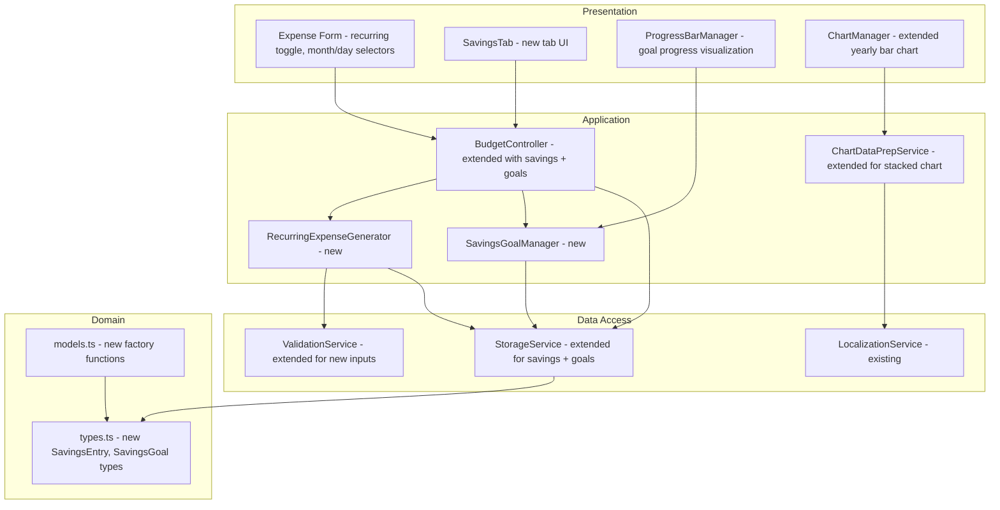

# Design Document: Budget Tracker Enhancements V2

## Overview

This design covers six enhancements to the Israeli Budget Tracker: recurring expense entry, separate month/day date selectors with expense filtering, a savings/investment tracking tab, monthly savings goals with progress bars, a comprehensive yearly bar chart, and yearly savings goals. All enhancements follow the existing architecture (domain types → data-access → application → presentation), use localStorage for persistence, and display all UI/errors in Hebrew (RTL).

The existing app uses TypeScript compiled via `build.js` into `public/app.js`, Chart.js for visualization, and a layered architecture with `StorageService`, `BudgetController`, `ValidationService`, and presentation managers (`EntryManager`, `ChartManager`).

## Architecture

The enhancements extend the existing layered architecture without restructuring:



### Design Decisions

1. **RecurringExpenseGenerator as a separate application-layer class** rather than embedding logic in BudgetController. This keeps the controller thin and the generation logic testable in isolation.

2. **SavingsEntry stored in a separate localStorage key** (`israeli-budget-tracker:savings`) rather than extending `FinancialData`. This avoids migration complexity and keeps savings data independent.

3. **Monthly savings goal stored as a simple numeric value** in localStorage (`israeli-budget-tracker:monthly-savings-goal`). The yearly goal is always derived (12×monthly) and never stored separately.

4. **Stacked bar chart uses Chart.js multi-dataset configuration** with one dataset per component (income, each expense category, savings). This leverages Chart.js's built-in stacking support.

5. **Date selectors replace the existing date input** in the expense form. The month selector also drives expense list filtering, coupling date selection with list display for a streamlined UX.

## Components and Interfaces

### New Types (domain/types.ts)

```typescript
/** Savings entry type */
export type SavingsType = 'savings' | 'investment' | 'pension';

/** Savings/Investment/Pension entry */
export interface SavingsEntry {
  id: string;
  type: SavingsType;
  description: string;
  amount: number;
  month: Date;
  createdAt: Date;
}

/** Input for creating a savings entry */
export interface SavingsEntryInput {
  type: SavingsType;
  description: string;
  amount: number;
  month: Date;
}

/** Recurring expense configuration */
export interface RecurringExpenseConfig {
  amount: number;
  category?: string;
  description?: string;
  dayOfMonth: number;
  startMonth: Date; // first day of start month
  endMonth: Date;   // first day of end month
}

/** Extended FinancialData to include savings */
export interface FinancialDataV2 extends FinancialData {
  savings: SavingsEntry[];
  monthlySavingsGoal: number | null;
}
```

### RecurringExpenseGenerator (application/)

```typescript
export class RecurringExpenseGenerator {
  constructor(
    private validationService: ValidationService,
    private storageService: StorageService
  ) {}

  /** Validate the recurring config (start <= end month) */
  validateConfig(config: RecurringExpenseConfig): ValidationResult;

  /** Generate individual expense records for each month in range */
  async generate(config: RecurringExpenseConfig): Promise<{
    saved: Expense[];
    failed: { month: Date; error: string }[];
  }>;

  /** Clamp day to last valid day of a given month */
  static clampDay(year: number, month: number, day: number): number;
}
```

### SavingsGoalManager (application/)

```typescript
export class SavingsGoalManager {
  constructor(private storageService: StorageService) {}

  /** Save monthly savings goal to localStorage */
  async setMonthlySavingsGoal(amount: number): Promise<void>;

  /** Get the current monthly savings goal, or null if not set */
  async getMonthlySavingsGoal(): Promise<number | null>;

  /** Calculate yearly goal as 12 × monthly goal */
  getYearlySavingsGoal(monthlyGoal: number): number;

  /** Calculate progress percentage (clamped 0-100) */
  calculateProgress(actual: number, goal: number): {
    percentage: number;
    actual: number;
    goal: number;
    deficit: number | null;
  };
}
```

### Extended StorageService

New methods added to the `StorageService` interface and `LocalStorageService`:

```typescript
// New storage key: 'israeli-budget-tracker:savings'
// New storage key: 'israeli-budget-tracker:monthly-savings-goal'

saveSavingsEntry(entry: SavingsEntry): Promise<void>;
loadSavingsEntries(): Promise<SavingsEntry[]>;
updateSavingsEntry(id: string, entry: SavingsEntry): Promise<void>;
deleteSavingsEntry(id: string): Promise<void>;
saveMonthlySavingsGoal(amount: number): Promise<void>;
loadMonthlySavingsGoal(): Promise<number | null>;
```

### Extended ValidationService

```typescript
validateRecurringExpenseConfig(config: RecurringExpenseConfig): ValidationResult;
validateSavingsEntry(input: SavingsEntryInput): ValidationResult;
validateSavingsGoal(amount: number): ValidationResult;
```

### Extended ChartDataPrepService

```typescript
export interface StackedBarChartData {
  labels: string[];                    // Hebrew month labels
  datasets: {
    label: string;                     // Dataset name (income, category, savings)
    data: number[];                    // Values per month
    backgroundColor: string;
    stack: string;                     // Stack group identifier
  }[];
}

prepareStackedBarChartData(
  monthlyReports: MonthlyReport[],
  localizationService: LocalizationService
): StackedBarChartData;
```

### Extended ChartManager

```typescript
renderStackedBarChart(
  containerId: string,
  data: StackedBarChartData,
  options?: ChartOptions
): void;
```

### Presentation Components

**SavingsTabManager** (new, presentation/):
- Renders the savings tab form and list
- Handles CRUD operations for SavingsEntry records
- Groups entries by type with subtotals
- Inline edit form, delete confirmation dialog

**ProgressBarManager** (new, presentation/):
- Renders progress bar HTML with percentage, amounts
- Handles green (≥100%) and red (negative/0%) states
- Used in both monthly and annual report views

**DateSelectorManager** (new logic in expense form):
- Renders month dropdown (Hebrew names) and day dropdown
- Updates day dropdown when month changes
- Triggers expense list filtering on month change

## Data Models

### localStorage Schema

| Key | Type | Description |
|-----|------|-------------|
| `israeli-budget-tracker:salaries` | `SalaryRecord[]` | Existing salary records |
| `israeli-budget-tracker:expenses` | `Expense[]` | Existing + recurring expense records |
| `israeli-budget-tracker:savings` | `SavingsEntry[]` | New savings/investment/pension entries |
| `israeli-budget-tracker:monthly-savings-goal` | `number \| null` | Monthly savings target in ₪ |

### SavingsEntry Serialization

```json
{
  "id": "uuid",
  "type": "savings | investment | pension",
  "description": "תיאור",
  "amount": 1000.00,
  "month": "2024-01-01T00:00:00.000Z",
  "createdAt": "2024-01-15T10:30:00.000Z"
}
```

### Recurring Expense Generation

Given a `RecurringExpenseConfig` with `startMonth=2024-01` and `endMonth=2024-03`, `dayOfMonth=15`, the generator produces 3 independent `Expense` records:
- `{ date: 2024-01-15, amount, category, description }`
- `{ date: 2024-02-15, amount, category, description }`
- `{ date: 2024-03-15, amount, category, description }`

If `dayOfMonth=31` and a month has fewer days (e.g., February), the day is clamped to the last valid day (28 or 29).

### Monthly Savings Calculation

`Monthly_Savings = netIncome - totalExpenses` (already computed in `MonthlyReport.netSavings`).

### Yearly Savings Goal

`Yearly_Savings_Goal = monthlySavingsGoal × 12`

Total actual yearly savings = sum of `MonthlyReport.netSavings` across 12 months (already in `AnnualReport.totalSavings`).


## Correctness Properties

*A property is a characteristic or behavior that should hold true across all valid executions of a system — essentially, a formal statement about what the system should do. Properties serve as the bridge between human-readable specifications and machine-verifiable correctness guarantees.*

### Property 1: Recurring expense generation count and content

*For any* valid `RecurringExpenseConfig` with `startMonth <= endMonth`, the `RecurringExpenseGenerator` should produce exactly `(endMonth - startMonth + 1)` expense records, and every generated record should have the same `amount`, `category`, and `description` as the input config.

**Validates: Requirements 1.3, 1.4**

### Property 2: Recurring expense day assignment with clamping

*For any* valid `RecurringExpenseConfig` and any target month in the range, the day of the generated expense's date should equal `min(config.dayOfMonth, lastDayOfTargetMonth)`. That is, the day is preserved when it exists in the month, and clamped to the last valid day otherwise.

**Validates: Requirements 1.5, 1.6**

### Property 3: Invalid recurring range is rejected

*For any* `RecurringExpenseConfig` where `startMonth` is strictly after `endMonth`, validation should fail and return an error.

**Validates: Requirements 1.8**

### Property 4: Valid days per month in date selector

*For any* month (1–12) and year, the day selector should offer exactly `N` options where `N` is the number of days in that month (28, 29, 30, or 31). When switching from a month with more days to one with fewer, the selected day should be clamped to the last valid day.

**Validates: Requirements 2.3, 2.4, 2.5**

### Property 5: Expense list filters by selected month

*For any* set of expenses and any selected month, the filtered expense list should contain exactly those expenses whose date falls within the selected month, and no others.

**Validates: Requirements 2.7, 2.8**

### Property 6: Savings entry persistence round trip

*For any* valid `SavingsEntry`, saving it to localStorage and then loading all savings entries should return a list containing an entry with the same `id`, `type`, `description`, `amount`, and `month`.

**Validates: Requirements 3.4**

### Property 7: Savings entries grouped by type with correct totals

*For any* set of `SavingsEntry` records, grouping by type should produce groups where (a) each group contains only entries of that type, and (b) the total for each group equals the sum of `amount` values of entries in that group.

**Validates: Requirements 3.5, 3.9**

### Property 8: Savings entry deletion removes from storage

*For any* set of saved `SavingsEntry` records and any entry `id` in that set, deleting by `id` and then loading should return a list that does not contain an entry with that `id`, and the list length should be one less than before.

**Validates: Requirements 3.8**

### Property 9: Non-positive amount validation

*For any* number ≤ 0 (including zero and negative values), validation should reject it as an invalid amount for both `SavingsEntryInput.amount` and monthly savings goal. The validation result should contain a Hebrew error message.

**Validates: Requirements 3.10, 4.9**

### Property 10: Monthly savings goal persistence round trip

*For any* positive number, saving it as the monthly savings goal and then loading should return the same value.

**Validates: Requirements 4.2**

### Property 11: Progress calculation

*For any* actual savings amount and any positive goal amount, `calculateProgress` should return a percentage equal to `clamp(0, 100, (actual / goal) * 100)`. When actual is negative, percentage should be 0 and deficit should equal the absolute value. When actual ≥ goal, percentage should be 100.

**Validates: Requirements 4.4, 4.5, 6.3, 6.4**

### Property 12: Stacked bar chart data preparation

*For any* array of 12 `MonthlyReport` objects, `prepareStackedBarChartData` should produce: (a) exactly 12 labels in Hebrew, (b) a dataset for net income, (c) a dataset for each unique expense category present across all months, (d) a dataset for monthly savings, and (e) all dataset `data` arrays should have length 12.

**Validates: Requirements 5.1, 5.2, 5.3, 5.4, 5.5**

### Property 13: Chart colors are distinct

*For any* set of datasets produced by `prepareStackedBarChartData`, all `backgroundColor` values should be distinct from each other.

**Validates: Requirements 5.9**

### Property 14: Yearly savings goal derivation

*For any* positive monthly savings goal amount, the yearly savings goal should equal exactly `monthlyGoal × 12`.

**Validates: Requirements 6.1**

## Error Handling

All error messages are in Hebrew, consistent with the existing codebase patterns.

| Scenario | Error Message (Hebrew) | Behavior |
|----------|----------------------|----------|
| Recurring: start month after end month | חודש ההתחלה חייב להיות לפני או שווה לחודש הסיום | Prevent submission, show error |
| Recurring: individual save failure | שמירת ההוצאה לחודש {month} נכשלה | Show error for failed month, continue saving others |
| Savings: non-positive amount | הסכום חייב להיות מספר חיובי גדול מאפס | Prevent submission, show error |
| Savings: delete confirmation | האם אתה בטוח שברצונך למחוק רשומה זו? | Show confirmation dialog |
| Savings goal: non-positive value | יעד החיסכון חייב להיות מספר חיובי גדול מאפס | Reject input, show error |
| Storage: corrupted savings data | קובץ הנתונים פגום. אנא שחזר מגיבוי. | Return empty array, log error |
| Storage: save failure | שמירת הנתונים נכשלה. אנא נסה שוב. | Throw error with Hebrew message |

### Error Handling Strategy

- **Validation errors**: Displayed inline next to the relevant form field, preventing submission.
- **Storage errors**: Caught at the controller level and surfaced to the UI as Hebrew toast/alert messages.
- **Partial failures** (recurring expense generation): The generator continues saving remaining records and returns a summary of successes and failures. The UI displays which months failed.
- **Data corruption**: Follows existing pattern — return empty data and log the error.

## Testing Strategy

### Dual Testing Approach

Both unit tests and property-based tests are required for comprehensive coverage.

**Unit tests** focus on:
- Specific examples (e.g., generating recurring expenses for Jan–Mar with day 15)
- Edge cases (e.g., day 31 in February, leap year handling)
- UI rendering checks (e.g., savings tab has correct form fields, progress bar shows green at 100%)
- Integration points (e.g., BudgetController calling RecurringExpenseGenerator then StorageService)
- Error conditions (e.g., storage failure during recurring generation)

**Property-based tests** focus on:
- Universal properties across all valid inputs (Properties 1–14 above)
- Comprehensive input coverage through randomization
- Each property test runs a minimum of 100 iterations

### Property-Based Testing Library

Use **fast-check** (`fc`) for TypeScript property-based testing. It integrates with the existing test setup and provides powerful arbitrary generators.

### Property Test Tagging

Each property test must include a comment referencing the design property:

```typescript
// Feature: budget-tracker-enhancements-v2, Property 1: Recurring expense generation count and content
```

### Test Organization

| Test File | Covers |
|-----------|--------|
| `src/application/RecurringExpenseGenerator.test.ts` | Properties 1, 2, 3 + unit tests for edge cases |
| `src/data-access/StorageService.test.ts` (extended) | Properties 6, 8, 10 + unit tests |
| `src/application/SavingsGoalManager.test.ts` | Properties 11, 14 + unit tests |
| `src/data-access/ValidationService.test.ts` (extended) | Property 9 + unit tests |
| `src/application/ChartDataPrepService.test.ts` | Properties 12, 13 + unit tests |
| `src/presentation/DateSelector.test.ts` | Property 4 + unit tests |
| `src/presentation/ExpenseFilter.test.ts` | Property 5 + unit tests |
| `src/presentation/SavingsTabManager.test.ts` | Property 7 + unit tests |

### Each correctness property MUST be implemented by a SINGLE property-based test.
