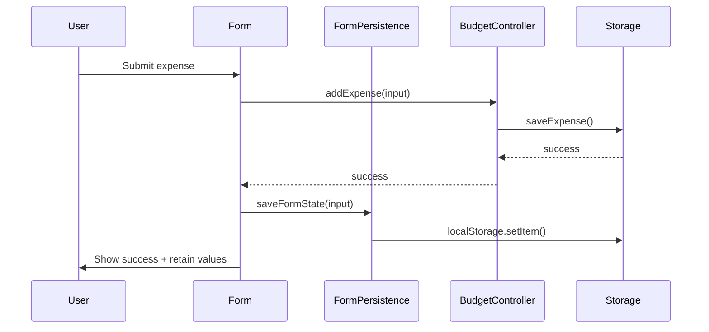
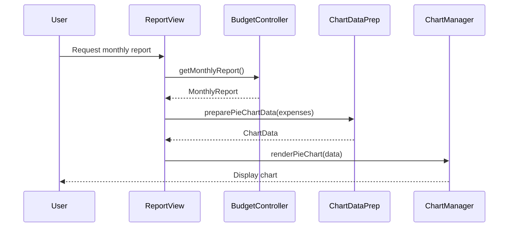

# Design Document: Budget Tracker UI Enhancements

## Overview

This design enhances the Israeli Budget Tracker with three key user experience improvements: form value persistence for faster data entry, visual expense analysis through interactive charts, and comprehensive annual reporting with savings calculations.

### Goals

1. Reduce data entry friction by persisting form values across submissions
2. Provide visual insights into spending patterns through pie and bar charts
3. Enable comprehensive annual financial analysis with total savings tracking
4. Improve tax calculation accuracy with configurable tax credit points
5. Maintain Hebrew/RTL support and accessibility standards

### Key Design Decisions

**Chart Library Selection**: Chart.js (v4.x) was selected for the following reasons:
- Lightweight (~200KB minified, ~60KB gzipped) - well under the 100KB requirement when gzipped
- Native browser support without build tools (CDN-compatible)
- Excellent RTL and internationalization support
- Built-in responsive behavior and accessibility features
- Active maintenance and comprehensive documentation
- Supports both pie and bar chart types with extensive customization

**Form Persistence Strategy**: LocalStorage-based persistence provides:
- Zero-latency form restoration (synchronous access)
- Persistence across browser sessions
- Simple integration with existing StorageService patterns
- No server-side dependencies

**Data Aggregation Approach**: Client-side aggregation leverages existing ExpenseManager patterns while adding new aggregation utilities for chart data preparation.

**Tax Credit Points Integration**: Extends the existing TaxCalculator to support configurable tax credit points (נקודות זיכוי) with:
- LocalStorage persistence for user's credit point configuration
- Monthly credit value of 223 ILS per point (2024 Israeli tax rate)
- Validation of credit points between 0 and 10
- Separate display of tax credit deduction in calculation results

## Architecture

### Component Structure

```
┌─────────────────────────────────────────────────────────┐
│                    UI Layer (main.js)                    │
│  ┌──────────────┐  ┌──────────────┐  ┌──────────────┐  │
│  │ Form Manager │  │ Chart Manager│  │ Report View  │  │
│  └──────────────┘  └──────────────┘  └──────────────┘  │
└─────────────────────────────────────────────────────────┘
                            │
┌─────────────────────────────────────────────────────────┐
│              Application Layer (Services)                │
│  ┌──────────────┐  ┌──────────────┐  ┌──────────────┐  │
│  │FormPersistence│ │ChartDataPrep │  │BudgetController│ │
│  │   Service    │  │   Service    │  │  (enhanced)  │  │
│  └──────────────┘  └──────────────┘  └──────────────┘  │
└─────────────────────────────────────────────────────────┘
                            │
┌─────────────────────────────────────────────────────────┐
│               Data Layer (Storage)                       │
│  ┌──────────────┐  ┌──────────────┐                     │
│  │ LocalStorage │  │ StorageService│                     │
│  │  (enhanced)  │  │  (existing)  │                     │
│  └──────────────┘  └──────────────┘                     │
└─────────────────────────────────────────────────────────┘
```

### Integration Points

1. **FormPersistenceService** integrates with existing expense form submission flow
2. **ChartDataPrepService** consumes data from ExpenseManager and BudgetController
3. **ChartManager** renders Chart.js visualizations in report views
4. **Enhanced MonthlyReport** includes pie chart container and data
5. **Enhanced AnnualReport** includes bar chart container and total savings calculation
6. **Enhanced TaxCalculator** incorporates tax credit points in tax calculations
7. **Tax credit points persistence** uses LocalStorage for user configuration

### Data Flow





## Components and Interfaces

### FormPersistenceService

Manages form state persistence to LocalStorage.

```typescript
interface FormPersistenceService {
  /**
   * Save form state to LocalStorage
   * @param formData - The form data to persist
   */
  saveFormState(formData: ExpenseFormState): void;

  /**
   * Load form state from LocalStorage
   * @returns The persisted form state or null if none exists
   */
  loadFormState(): ExpenseFormState | null;

  /**
   * Clear persisted form state
   */
  clearFormState(): void;
}

interface ExpenseFormState {
  amount: string;
  date: string;
  category: string;
  description: string;
}
```

**Implementation Notes**:
- Storage key: `"lastExpenseInput"`
- Validates date and amount before restoration
- Handles corrupted data gracefully by returning null
- Synchronous operations (LocalStorage is synchronous)

### ChartDataPrepService

Transforms expense data into chart-compatible formats.

```typescript
interface ChartDataPrepService {
  /**
   * Prepare data for pie chart visualization
   * @param expenses - Array of expenses to aggregate
   * @returns Chart data with labels and values
   */
  preparePieChartData(expenses: Expense[]): PieChartData;

  /**
   * Prepare data for bar chart visualization
   * @param monthlyReports - Array of monthly reports
   * @param localizationService - For month name translation
   * @returns Chart data with labels and values
   */
  prepareBarChartData(
    monthlyReports: MonthlyReport[],
    localizationService: LocalizationService
  ): BarChartData;
}

interface PieChartData {
  labels: string[];
  values: number[];
  colors: string[];
}

interface BarChartData {
  labels: string[];
  values: number[];
}
```

**Aggregation Logic**:
- Pie chart: Group expenses by category, sum amounts, sort descending
- Bar chart: Extract monthly totals, maintain chronological order
- Null categories mapped to "ללא קטגוריה"
- All amounts rounded to 2 decimal places

### ChartManager

Handles Chart.js rendering and lifecycle.

```typescript
interface ChartManager {
  /**
   * Render a pie chart in the specified container
   * @param containerId - DOM element ID for chart canvas
   * @param data - Chart data to visualize
   * @param options - Chart.js configuration options
   */
  renderPieChart(
    containerId: string,
    data: PieChartData,
    options?: ChartOptions
  ): void;

  /**
   * Render a bar chart in the specified container
   * @param containerId - DOM element ID for chart canvas
   * @param data - Chart data to visualize
   * @param options - Chart.js configuration options
   */
  renderBarChart(
    containerId: string,
    data: BarChartData,
    options?: ChartOptions
  ): void;

  /**
   * Destroy existing chart instance to prevent memory leaks
   * @param containerId - DOM element ID of chart to destroy
   */
  destroyChart(containerId: string): void;
}

interface ChartOptions {
  responsive?: boolean;
  maintainAspectRatio?: boolean;
  plugins?: {
    legend?: { display: boolean; position: string };
    tooltip?: { enabled: boolean };
  };
}
```

**Chart.js Configuration**:
- Responsive: true (adapts to container width)
- RTL support: Enabled via Chart.js locale settings
- Accessibility: ARIA labels and alt text on canvas elements
- Color palette: Distinct, high-contrast colors for categories
- Tooltips: Display exact values on hover

### Enhanced Domain Types

```typescript
// Extension to existing MonthlyReport
interface MonthlyReport {
  // ... existing fields ...
  chartData?: PieChartData; // Optional chart data for UI layer
}

// Extension to existing AnnualReport
interface AnnualReport {
  // ... existing fields ...
  chartData?: BarChartData; // Optional chart data for UI layer
}
```

### Category Management

The expense category list is extended to include "דירה" (Rent):

```typescript
const EXPENSE_CATEGORIES = [
  'מזון',        // Food
  'תחבורה',      // Transportation
  'בילויים',     // Entertainment
  'בריאות',      // Health
  'חינוך',       // Education
  'דירה',        // Rent (NEW)
  'אחר'          // Other
];
```

Categories are sorted alphabetically in Hebrew for the dropdown display.

### Tax Credit Points Configuration

```typescript
interface TaxCreditConfig {
  points: number;           // Number of credit points (0-10, up to 2 decimals)
  monthlyValuePerPoint: number; // 223 ILS per point (2024 rate)
}

const DEFAULT_TAX_CREDIT_POINTS = 2.25; // Standard single person
const MONTHLY_CREDIT_VALUE = 223; // ILS per point (2024)
const MIN_CREDIT_POINTS = 0;
const MAX_CREDIT_POINTS = 10;
```

**Tax Calculation Enhancement**:
The existing TaxCalculator is enhanced to accept tax credit points and calculate the credit deduction:

```typescript
interface TaxCalculationInput {
  grossSalary: number;
  taxCreditPoints?: number; // Optional, defaults to 2.25
}

interface TaxCalculationResult {
  grossSalary: number;
  taxableIncome: number;
  incomeTax: number;
  nationalInsurance: number;
  healthInsurance: number;
  taxCreditDeduction: number; // NEW: Credit from tax points
  netSalary: number;
}
```

**Tax Credit Calculation Logic**:
```
taxCreditDeduction = taxCreditPoints × 223
adjustedTax = max(0, calculatedTax - taxCreditDeduction)
```

The credit reduces the calculated income tax but cannot result in negative tax.

## Data Models

### Form State Storage

```typescript
// Stored in LocalStorage under key "lastExpenseInput"
interface StoredFormState {
  amount: string;      // String representation for form input
  date: string;        // ISO date string (YYYY-MM-DD)
  category: string;    // Category name or empty string
  description: string; // Description text or empty string
  timestamp: number;   // When this state was saved (for staleness checks)
}
```

### Chart Data Structures

```typescript
// Pie chart data structure
interface PieChartData {
  labels: string[];    // Category names (e.g., ["מזון", "תחבורה", "דירה"])
  values: number[];    // Amounts per category (e.g., [1500.00, 800.00, 3500.00])
  colors: string[];    // Hex colors (e.g., ["#FF6384", "#36A2EB", "#FFCE56"])
}

// Bar chart data structure
interface BarChartData {
  labels: string[];    // Month names (e.g., ["ינואר 2024", "פברואר 2024"])
  values: number[];    // Total expenses per month (e.g., [5800.00, 6200.00])
}
```

### Aggregation Results

```typescript
// Intermediate aggregation structure
interface CategoryAggregation {
  category: string;
  total: number;
  count: number;
}

// Monthly aggregation structure
interface MonthlyAggregation {
  month: Date;
  monthName: string;
  totalExpenses: number;
  totalIncome: number;
}
```

### Enhanced Annual Report Calculation

The total savings calculation extends the existing AnnualReport:

```typescript
// Total savings = Sum of all monthly net income - Sum of all monthly expenses
// Precision: Exactly 2 decimal places
// Display: Green if positive, red if negative
interface TotalSavingsDisplay {
  amount: number;        // The calculated total savings
  formatted: string;     // Formatted with currency symbol
  isPositive: boolean;   // For color coding
}
```


## Correctness Properties

*A property is a characteristic or behavior that should hold true across all valid executions of a system-essentially, a formal statement about what the system should do. Properties serve as the bridge between human-readable specifications and machine-verifiable correctness guarantees.*

### Property Reflection

After analyzing all acceptance criteria, the following redundancies were identified and eliminated:

- **1.2 and 1.3** are subsumed by **1.1** (form retention after submission)
- **3.2** is redundant with **3.1** (rent category availability)
- **3.5** is redundant with **3.4** (rent category in reports)
- **7.4** is redundant with **7.1** (category aggregation)
- **7.5** is redundant with **7.2** (monthly aggregation)
- **7.7** is redundant with **4.3** (chronological ordering)
- **7.8** is redundant with **2.5** (null category handling)
- **8.1 and 8.2** are redundant with **1.7** (form restoration from storage)
- **10.5** is covered by **10.4** (validation error handling)

The remaining properties provide unique validation value and comprehensive coverage.

### Property 1: Form Value Persistence After Submission

*For any* valid expense input, when the expense is successfully submitted, the form fields should retain all submitted values (amount, date, category, description).

**Validates: Requirements 1.1**

### Property 2: Form State Persistence Across Tab Navigation

*For any* valid expense input, when submitted and the user navigates away from the expense tab and returns, the form should display the most recently submitted values.

**Validates: Requirements 1.5**

### Property 3: Form State Round-Trip Through LocalStorage

*For any* valid expense input, when saved to LocalStorage and the application is reloaded, the form should be populated with the same values that were saved.

**Validates: Requirements 1.7, 8.7**

### Property 4: Pie Chart Category Aggregation

*For any* set of expenses, when preparing pie chart data, expenses with the same category should be grouped together and their amounts summed correctly to 2 decimal places.

**Validates: Requirements 2.2, 7.1**

### Property 5: Pie Chart Slice Count Matches Category Count

*For any* set of expenses with multiple categories, the number of pie chart slices should equal the number of unique categories (including uncategorized).

**Validates: Requirements 2.3**

### Property 6: Pie Chart Data Completeness

*For any* pie chart data, the labels array should contain all category names and the values array should contain corresponding amounts, with both arrays having equal length.

**Validates: Requirements 2.4**

### Property 7: Null Category Mapping

*For any* expense with a null or undefined category, when preparing chart data, it should be assigned to the "ללא קטגוריה" (Uncategorized) category.

**Validates: Requirements 2.5**

### Property 8: Distinct Colors for Categories

*For any* pie chart data, the number of colors should equal the number of categories and all colors should be unique (no duplicates).

**Validates: Requirements 2.6**

### Property 9: Category List Alphabetical Ordering

*For any* expense category list, the categories should be sorted in alphabetical order according to Hebrew collation rules.

**Validates: Requirements 3.3**

### Property 10: Bar Chart Monthly Aggregation

*For any* set of monthly reports covering a 12-month period, the bar chart data should contain exactly 12 values, each representing the total expenses for that month.

**Validates: Requirements 4.2, 7.2**

### Property 11: Bar Chart Chronological Ordering

*For any* bar chart data, the month labels should be in chronological order from earliest to latest.

**Validates: Requirements 4.3**

### Property 12: Bar Chart Month Name Localization

*For any* month in the bar chart, the label should match the Hebrew month name returned by LocalizationService.getMonthName() for that month number.

**Validates: Requirements 4.6**

### Property 13: Total Savings Calculation Correctness

*For any* annual report with monthly data, the total savings should equal the sum of all monthly net incomes minus the sum of all monthly expenses, calculated to exactly 2 decimal places.

**Validates: Requirements 5.2, 5.8**

### Property 14: Total Savings Currency Formatting

*For any* total savings amount, when displayed, it should be formatted using LocalizationService.formatCurrency() with the ₪ symbol and 2 decimal places.

**Validates: Requirements 5.4**

### Property 15: Negative Savings Color Coding

*For any* total savings amount that is negative, the display color should be red.

**Validates: Requirements 5.5**

### Property 16: Positive Savings Color Coding

*For any* total savings amount that is positive or zero, the display color should be green.

**Validates: Requirements 5.6**

### Property 17: Decimal Precision in Aggregations

*For any* expense amount in chart data preparation, the value should be rounded to exactly 2 decimal places.

**Validates: Requirements 7.3**

### Property 18: Pie Chart Descending Sort Order

*For any* pie chart data, the categories should be sorted by amount in descending order (highest amount first).

**Validates: Requirements 7.6**

### Property 19: Restored Date Validation

*For any* date value restored from LocalStorage, it should be validated as a valid Date object before populating the form field.

**Validates: Requirements 8.4**

### Property 20: Restored Amount Validation

*For any* amount value restored from LocalStorage, it should be validated as a positive number before populating the form field.

**Validates: Requirements 8.5**

### Property 21: Chart Accessibility Labels

*For any* rendered chart, the canvas element should have an aria-label attribute describing the chart data for screen readers.

**Validates: Requirements 9.5**

### Property 22: Color Contrast Ratio

*For any* color in the chart color palette, the contrast ratio against the background should be at least 3:1 for accessibility compliance.

**Validates: Requirements 9.6**

### Property 23: Tax Credit Points Range Validation

*For any* tax credit points value entered by the user, it should be validated to be between 0 and 10 (inclusive) with at most 2 decimal places.

**Validates: Requirements 10.2, 10.4**

### Property 24: Tax Credit Deduction Calculation

*For any* valid tax credit points value, the tax credit deduction should equal the points multiplied by 223 (the monthly credit value), calculated to exactly 2 decimal places.

**Validates: Requirements 10.7**

### Property 25: Tax Credit Points Persistence

*For any* valid tax credit points value entered and saved, when the application is reloaded, the salary form should be populated with the same tax credit points value from LocalStorage.

**Validates: Requirements 10.8, 10.9**

### Property 26: Non-Negative Tax After Credit

*For any* tax calculation with tax credit points, the final tax amount after applying the credit deduction should never be negative (minimum value is 0).

**Validates: Requirements 10.6**

## Error Handling

### Form Persistence Errors

**Corrupted LocalStorage Data**:
- Detection: JSON.parse() throws SyntaxError
- Handling: Log warning to console, return null from loadFormState()
- User Impact: Form displays empty fields (graceful degradation)
- Recovery: User can submit new expense to overwrite corrupted data

**Invalid Restored Values**:
- Detection: Date validation fails or amount is not a positive number
- Handling: Skip invalid fields, populate only valid fields
- User Impact: Partial form restoration with invalid fields empty
- Recovery: User manually enters missing values

**LocalStorage Quota Exceeded**:
- Detection: localStorage.setItem() throws QuotaExceededError
- Handling: Log error, continue without persistence
- User Impact: Form values not persisted (feature degrades gracefully)
- Recovery: User can clear browser data to free space

### Chart Rendering Errors

**Empty Data Sets**:
- Detection: expenses.length === 0 or monthlyReports.length === 0
- Handling: Display message "אין הוצאות לחודש זה" for pie chart, show zero bars for bar chart
- User Impact: Informative message instead of broken chart
- Recovery: N/A (expected behavior)

**Chart.js Initialization Failure**:
- Detection: Chart constructor throws error or returns null
- Handling: Log error, display fallback text-based summary
- User Impact: No visual chart, but data still accessible in tables
- Recovery: User can refresh page to retry

**Invalid Chart Data**:
- Detection: Data validation before passing to Chart.js (empty labels, mismatched array lengths)
- Handling: Log error with details, skip chart rendering
- User Impact: Chart not displayed, error logged for debugging
- Recovery: Fix data preparation logic

### Data Aggregation Errors

**Null/Undefined Values**:
- Detection: Check for null/undefined in expense amounts or dates
- Handling: Skip invalid records, log warning with record ID
- User Impact: Invalid expenses excluded from charts (data integrity maintained)
- Recovery: User can correct invalid expense records

**Date Parsing Failures**:
- Detection: new Date() returns Invalid Date
- Handling: Skip record, log error with original date value
- User Impact: Record excluded from time-based aggregations
- Recovery: User can correct date format in expense record

**Numeric Overflow**:
- Detection: Result of aggregation is Infinity or NaN
- Handling: Log error, display "שגיאה בחישוב" (Calculation Error)
- User Impact: Chart not displayed for affected data
- Recovery: Check for extremely large expense values

### Hebrew/RTL Rendering Issues

**Chart.js RTL Configuration**:
- Detection: Visual inspection or automated screenshot tests
- Handling: Ensure Chart.js locale is set to 'he' with RTL direction
- User Impact: Charts display correctly in RTL layout
- Recovery: Configuration fix in ChartManager initialization

**Font Rendering**:
- Detection: Hebrew characters display as boxes or question marks
- Handling: Ensure proper font stack includes Hebrew-compatible fonts
- User Impact: Text displays correctly in charts
- Recovery: Update CSS font-family declarations

## Testing Strategy

### Dual Testing Approach

This feature requires both unit tests and property-based tests for comprehensive coverage:

**Unit Tests** focus on:
- Specific examples (e.g., rent category exists in dropdown)
- Edge cases (e.g., empty expense list, no LocalStorage data)
- Integration points (e.g., Chart.js initialization)
- Error conditions (e.g., corrupted LocalStorage data)

**Property-Based Tests** focus on:
- Universal properties across all inputs (e.g., aggregation correctness)
- Data transformation invariants (e.g., round-trip serialization)
- Comprehensive input coverage through randomization

Both approaches are complementary and necessary. Unit tests catch specific bugs and validate concrete examples, while property tests verify general correctness across the input space.

### Property-Based Testing Configuration

**Library Selection**: 
- JavaScript: fast-check (https://github.com/dubzzz/fast-check)
- Lightweight, mature, excellent TypeScript support
- Integrates with Jest/Vitest test runners

**Test Configuration**:
- Minimum 100 iterations per property test (due to randomization)
- Each property test must reference its design document property
- Tag format: `// Feature: budget-tracker-ui-enhancements, Property {number}: {property_text}`

**Example Property Test Structure**:

```typescript
import fc from 'fast-check';

// Feature: budget-tracker-ui-enhancements, Property 4: Pie Chart Category Aggregation
test('category aggregation sums expenses correctly', () => {
  fc.assert(
    fc.property(
      fc.array(expenseArbitrary()),
      (expenses) => {
        const chartData = chartDataPrepService.preparePieChartData(expenses);
        
        // Verify aggregation correctness
        const expectedTotals = aggregateByCategory(expenses);
        chartData.labels.forEach((category, index) => {
          const actual = chartData.values[index];
          const expected = expectedTotals.get(category);
          expect(actual).toBeCloseTo(expected, 2);
        });
      }
    ),
    { numRuns: 100 }
  );
});
```

### Unit Test Coverage

**FormPersistenceService**:
- Save and load form state with valid data
- Handle corrupted JSON in LocalStorage
- Handle missing LocalStorage data
- Validate restored date values
- Validate restored amount values
- Clear form state

**ChartDataPrepService**:
- Aggregate expenses by category
- Aggregate expenses by month
- Handle null categories (map to "ללא קטגוריה")
- Sort pie chart data descending by amount
- Sort bar chart data chronologically
- Handle empty expense arrays
- Round amounts to 2 decimal places

**ChartManager**:
- Render pie chart with valid data
- Render bar chart with valid data
- Destroy existing chart instances
- Handle Chart.js initialization errors
- Apply RTL configuration
- Set accessibility labels

**TaxCalculator Enhancement**:
- Calculate tax with default credit points (2.25)
- Calculate tax with custom credit points
- Validate credit points range (0-10)
- Validate credit points decimal precision (max 2 decimals)
- Apply credit deduction correctly
- Ensure tax never goes negative after credit
- Persist credit points to LocalStorage
- Restore credit points from LocalStorage

**Integration Tests**:
- Form submission triggers persistence
- Monthly report includes pie chart
- Annual report includes bar chart and total savings
- Rent category appears in dropdown
- Rent category flows through to reports
- Tax calculation with credit points displays correct net salary
- Tax credit points persist across page reloads

### Test Data Generators

For property-based testing, the following generators are needed:

```typescript
// Generate random valid expenses
const expenseArbitrary = () => fc.record({
  id: fc.uuid(),
  amount: fc.double({ min: 0.01, max: 100000, noNaN: true }),
  date: fc.date({ min: new Date('2020-01-01'), max: new Date('2025-12-31') }),
  category: fc.option(fc.constantFrom('מזון', 'תחבורה', 'בילויים', 'בריאות', 'חינוך', 'דירה', 'אחר'), { nil: null }),
  description: fc.option(fc.string(), { nil: null }),
  createdAt: fc.date()
});

// Generate random monthly reports
const monthlyReportArbitrary = () => fc.record({
  month: fc.date({ min: new Date('2020-01-01'), max: new Date('2025-12-31') }),
  netIncome: fc.double({ min: 0, max: 50000, noNaN: true }),
  expenses: fc.array(expenseArbitrary(), { maxLength: 50 }),
  totalExpenses: fc.double({ min: 0, max: 50000, noNaN: true }),
  expensesByCategory: fc.dictionary(fc.string(), fc.double({ min: 0, max: 10000 })),
  netSavings: fc.double({ min: -50000, max: 50000, noNaN: true })
});

// Generate random form state
const formStateArbitrary = () => fc.record({
  amount: fc.double({ min: 0.01, max: 100000 }).map(n => n.toFixed(2)),
  date: fc.date().map(d => d.toISOString().split('T')[0]),
  category: fc.constantFrom('', 'מזון', 'תחבורה', 'בילויים', 'בריאות', 'חינוך', 'דירה', 'אחר'),
  description: fc.string({ maxLength: 200 })
});

// Generate random tax credit points
const taxCreditPointsArbitrary = () => fc.double({ 
  min: 0, 
  max: 10, 
  noNaN: true 
}).map(n => Math.round(n * 100) / 100); // Round to 2 decimals
```

### Manual Testing Checklist

Due to the visual and interactive nature of charts, manual testing is required for:

- [ ] Charts display correctly in Chrome, Firefox, Safari
- [ ] Charts are responsive on mobile devices (320px to 1920px width)
- [ ] Hebrew text renders correctly in RTL direction
- [ ] Chart tooltips appear on hover with correct values
- [ ] Chart colors have sufficient contrast
- [ ] Screen readers announce chart data correctly
- [ ] Form values persist after browser refresh
- [ ] Form values persist after tab navigation
- [ ] Rent category appears in dropdown in correct alphabetical position
- [ ] Empty expense list shows "אין הוצאות לחודש זה" message
- [ ] Total savings displays in green when positive
- [ ] Total savings displays in red when negative
- [ ] Tax credit points input accepts values between 0 and 10
- [ ] Tax credit points input rejects values outside valid range
- [ ] Tax credit points default to 2.25 on first load
- [ ] Tax credit points persist after page refresh
- [ ] Tax calculation shows credit deduction separately
- [ ] Tax never goes negative after applying credit

### Performance Testing

**Chart Rendering Performance**:
- Test with 1000+ expenses to ensure aggregation completes in <500ms
- Test chart rendering with 12 months of data completes in <200ms
- Monitor memory usage for chart instances (destroy old charts before creating new ones)

**LocalStorage Performance**:
- Form state save/load should complete in <10ms
- Test with large description fields (up to 1000 characters)

