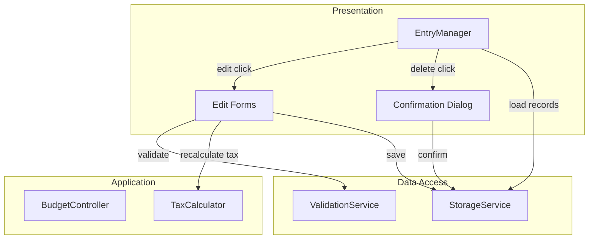

# Design Document: Edit Previous Entries

## Overview

This feature extends the Israeli Budget Tracker with CRUD operations for previously entered salary and expense records. Currently, users can only create records — this feature adds the ability to view, edit, and delete them.

The design adds:
- An `EntryManager` UI component that renders entry lists with edit/delete controls
- `updateSalary`, `updateExpense`, `deleteSalary`, and `deleteExpense` methods on the `StorageService`
- Edit forms that reuse existing validation logic and recalculate taxes on salary edits
- Confirmation dialogs for destructive delete operations

Reports remain consistent because they already read from `StorageService.loadAllData()` — once a record is updated or removed, the next report generation automatically reflects the change.

### Key Design Decisions

1. **ID-based operations**: All update/delete operations use the record's `id` field, which is already generated by `generateId()` in `models.ts`.
2. **Tax recalculation on salary edit**: When a salary record is edited, the `TaxCalculator` recalculates all deductions from the updated components, producing a fresh `TaxCalculationResult`.
3. **Preserve metadata on edit**: The `id` and `createdAt` fields are preserved when updating a record; only the user-editable fields change.
4. **In-place list update**: After an edit or delete, the `EntryManager` updates the DOM list directly rather than reloading all data, keeping the UI responsive.
5. **Hebrew error messages**: All validation errors and the "record not found" storage error use Hebrew messages, consistent with the existing app.

## Architecture

The feature fits into the existing layered architecture without introducing new layers:



The `EntryManager` is a new presentation-layer component. It calls existing services (`StorageService`, `ValidationService`, `TaxCalculator`) through the same patterns used by the salary and expense form handlers in `main.js`.

## Components and Interfaces

### StorageService Extensions

The `StorageService` interface gains four new methods:

```typescript
export interface StorageService {
  // Existing
  saveSalary(salary: SalaryRecord): Promise<void>;
  saveExpense(expense: Expense): Promise<void>;
  loadAllData(): Promise<FinancialData>;

  // New
  updateSalary(id: string, salary: SalaryRecord): Promise<void>;
  updateExpense(id: string, expense: Expense): Promise<void>;
  deleteSalary(id: string): Promise<void>;
  deleteExpense(id: string): Promise<void>;
}
```

#### updateSalary(id, salary)
- Loads all salaries from localStorage
- Finds the record matching `id`; throws Hebrew error if not found
- Replaces the matched record with `salary` (preserving `id` and `createdAt`)
- Re-sorts by month descending
- Saves back to localStorage

#### updateExpense(id, expense)
- Same pattern as `updateSalary` but for expenses
- Re-sorts by date descending

#### deleteSalary(id) / deleteExpense(id)
- Loads records, filters out the one matching `id`
- Throws Hebrew error if `id` not found
- Saves the filtered array back to localStorage

### EntryManager (Presentation)

A new class in `public/main.js` (or a separate `public/entryManager.js` file) that:

1. **renderSalaryList(container)**: Fetches all salary records via `StorageService.loadAllData()`, renders them sorted by month descending with month, gross salary, net income, and edit/delete buttons.
2. **renderExpenseList(container)**: Same for expenses — date, amount, category, description, and edit/delete buttons.
3. **showEditSalaryForm(record)**: Populates an edit form with the salary record's components and month. On submit, validates via `ValidationService`, recalculates via `TaxCalculator`, calls `StorageService.updateSalary()`, and refreshes the list.
4. **showEditExpenseForm(record)**: Populates an edit form with expense fields. On submit, validates and calls `StorageService.updateExpense()`.
5. **showDeleteConfirmation(type, id)**: Shows a modal dialog with Hebrew confirmation text. On confirm, calls the appropriate delete method and removes the item from the list.
6. **showEmptyState(container, type)**: Renders a Hebrew message when no records exist.

### Confirmation Dialog

A simple modal overlay with:
- Hebrew message: "האם אתה בטוח שברצונך למחוק רשומה זו?" (Are you sure you want to delete this record?)
- Two buttons: "מחק" (Delete) and "ביטול" (Cancel)
- Clicking outside the dialog or pressing Escape triggers cancel

### Edit Forms

Edit forms reuse the same field structure as the existing salary and expense forms but are pre-populated with the record's current values. They include:
- A hidden field or data attribute storing the record `id`
- A cancel button that closes the form without saving
- The same validation rules as the create forms (via `ValidationService`)

## Data Models

No new types are needed. The existing types fully support this feature:

| Type | Fields Used | Role |
|------|------------|------|
| `SalaryRecord` | `id`, `salaryComponents`, `month`, `taxCalculation`, `createdAt` | Identified by `id` for update/delete |
| `Expense` | `id`, `amount`, `date`, `category`, `description`, `createdAt` | Identified by `id` for update/delete |
| `SalaryComponents` | all fields | Pre-populated in edit form |
| `TaxCalculationResult` | all fields | Recalculated on salary edit |
| `ValidationResult` | `isValid`, `errors` | Used for edit form validation |
| `FinancialData` | `salaries`, `expenses` | Loaded to render entry lists |

### Storage Format

No changes to the localStorage schema. Records are stored as JSON arrays under the existing keys:
- `israeli-budget-tracker:salaries`
- `israeli-budget-tracker:expenses`

The `id` field already exists on every record, so update and delete operations can locate records by ID without any migration.


## Correctness Properties

*A property is a characteristic or behavior that should hold true across all valid executions of a system — essentially, a formal statement about what the system should do. Properties serve as the bridge between human-readable specifications and machine-verifiable correctness guarantees.*

### Property 1: Salary list sorted by month descending

*For any* set of salary records stored in the StorageService, the Entry_List rendered by the EntryManager SHALL display them in descending order by month (newest first).

**Validates: Requirements 1.1**

### Property 2: Expense list sorted by date descending

*For any* set of expense records stored in the StorageService, the Entry_List rendered by the EntryManager SHALL display them in descending order by date (newest first).

**Validates: Requirements 2.1**

### Property 3: Salary display contains required fields

*For any* SalaryRecord, the rendered Entry_List item SHALL contain the month, gross salary, and net income values from that record.

**Validates: Requirements 1.2**

### Property 4: Expense display contains required fields

*For any* Expense record, the rendered Entry_List item SHALL contain the date, amount, category, and description values from that record.

**Validates: Requirements 2.2**

### Property 5: Each record has edit and delete controls

*For any* record (salary or expense) rendered in an Entry_List, the rendered output SHALL contain both an edit button and a delete button.

**Validates: Requirements 1.4, 2.4**

### Property 6: Edit form pre-populated with current values

*For any* SalaryRecord or Expense record, when the edit form is opened, each editable field SHALL be pre-populated with the corresponding value from the record.

**Validates: Requirements 3.1, 4.1**

### Property 7: Invalid input rejected by validation

*For any* invalid salary components (negative values, zero gross) or invalid expense input (non-positive amount, invalid date), the ValidationService SHALL return `isValid: false` with non-empty Hebrew error messages, and the storage SHALL remain unchanged.

**Validates: Requirements 3.4, 4.4**

### Property 8: Cancel is a no-op on storage

*For any* record and any state of the edit form or confirmation dialog, if the user cancels the operation, the record in StorageService SHALL be identical to its state before the operation was initiated.

**Validates: Requirements 3.5, 4.5, 5.4, 6.4**

### Property 9: Update preserves id and createdAt

*For any* record (salary or expense), after a successful update via StorageService, the returned record SHALL have the same `id` and `createdAt` values as the original record.

**Validates: Requirements 4.2**

### Property 10: Sort order preserved after update

*For any* list of salary records and any valid update to one record, the stored list SHALL remain sorted by month descending after the update. *For any* list of expense records and any valid update, the stored list SHALL remain sorted by date descending.

**Validates: Requirements 7.1, 7.2**

### Property 11: Delete removes exactly one record

*For any* list of records and any valid ID present in that list, calling delete SHALL reduce the record count by exactly 1, and the deleted ID SHALL not appear in the resulting list.

**Validates: Requirements 7.3, 7.4**

### Property 12: Non-existent ID throws Hebrew error

*For any* ID that does not match any stored record, calling update or delete on the StorageService SHALL throw an error whose message is a non-empty Hebrew string.

**Validates: Requirements 7.5**

### Property 13: Update round-trip

*For any* stored record (salary or expense) and any valid updated values, updating the record then calling `loadAllData()` SHALL return data containing a record with the updated values at the matching ID.

**Validates: Requirements 7.6, 7.7**

### Property 14: Reports reflect current storage state

*For any* sequence of edits and deletions applied to stored records, generating a monthly or annual report afterward SHALL produce totals consistent with the current set of records in StorageService (i.e., the sum of net incomes and expenses in the report matches the sum of the records currently in storage for that period).

**Validates: Requirements 8.1, 8.2**

## Error Handling

| Scenario | Behavior | Message |
|----------|----------|---------|
| Update/delete with non-existent ID | Throw Error | `הרשומה לא נמצאה` (Record not found) |
| localStorage save failure | Throw Error | `שמירת הנתונים נכשלה. אנא נסה שוב.` (existing message) |
| Invalid salary components on edit | Show validation errors, retain form | Hebrew messages from `ValidationService` |
| Invalid expense data on edit | Show validation errors, retain form | Hebrew messages from `ValidationService` |
| Corrupted localStorage data | Throw Error | `קובץ הנתונים פגום. אנא שחזר מגיבוי.` (existing message) |

Error handling follows the existing pattern: `StorageService` throws errors with Hebrew messages, and the presentation layer catches them and displays them via the `showError()` function already in `main.js`.

## Testing Strategy

### Property-Based Testing

Use `fast-check` (already installed) with Vitest. Each property test runs a minimum of 100 iterations.

Property tests focus on the `StorageService` methods (`updateSalary`, `updateExpense`, `deleteSalary`, `deleteExpense`) since these are pure data operations that are well-suited to property-based testing. Properties 1–6 and 8 involve UI rendering and are better covered by unit tests with specific examples.

Each property-based test MUST be tagged with a comment referencing the design property:
```
// Feature: edit-previous-entries, Property 13: Update round-trip
```

Property tests to implement:
- **Property 9**: Generate random records, update them, verify `id` and `createdAt` are preserved
- **Property 10**: Generate random record lists, perform updates, verify sort order is maintained
- **Property 11**: Generate random record lists, delete a random record, verify count decreases by 1 and ID is gone
- **Property 12**: Generate random IDs not in the stored list, verify error is thrown with Hebrew message
- **Property 13**: Generate random records, update with random valid values, load and verify round-trip

### Unit Testing

Unit tests cover specific examples, edge cases, and UI behavior:

- **Empty state**: Verify empty message is shown when no records exist (Requirements 1.3, 2.3)
- **Rendering**: Verify a specific salary/expense record renders with correct fields (Properties 3, 4, 5)
- **Edit form pre-population**: Verify form fields match a specific record's values (Property 6)
- **Validation rejection**: Verify specific invalid inputs are rejected with Hebrew errors (Property 7)
- **Cancel no-op**: Verify cancel leaves storage unchanged (Property 8)
- **Report consistency**: Verify that after editing/deleting a record, the report totals match (Property 14)
- **Confirmation dialog**: Verify dialog appears on delete click, confirm triggers delete, cancel closes dialog (Requirements 5.1, 6.1)

### Test File Organization

- `src/data-access/StorageService.test.ts` — extend with update/delete property tests and unit tests
- `src/presentation/EntryManager.test.ts` — new file for UI rendering and interaction tests (if EntryManager is extracted to TypeScript; otherwise test via integration tests)
