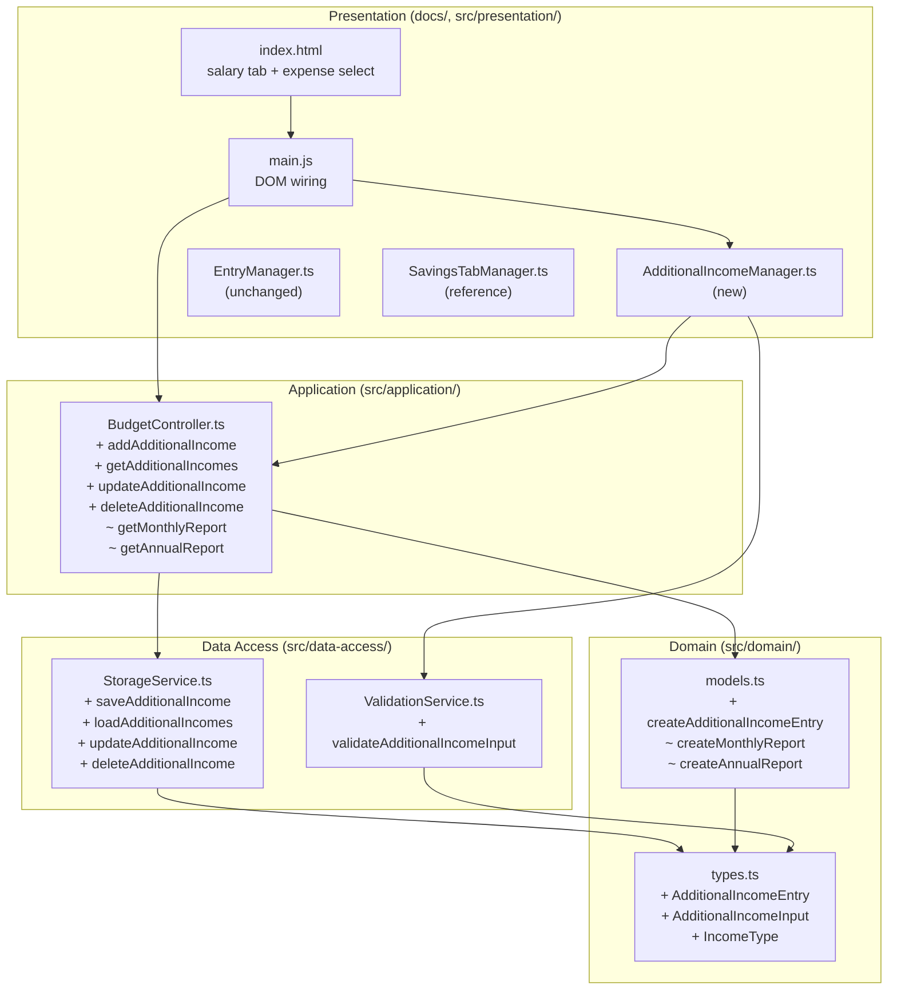
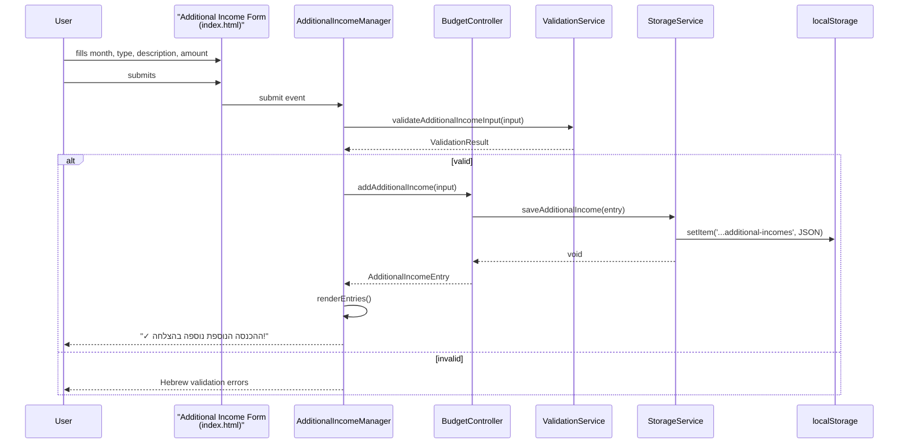
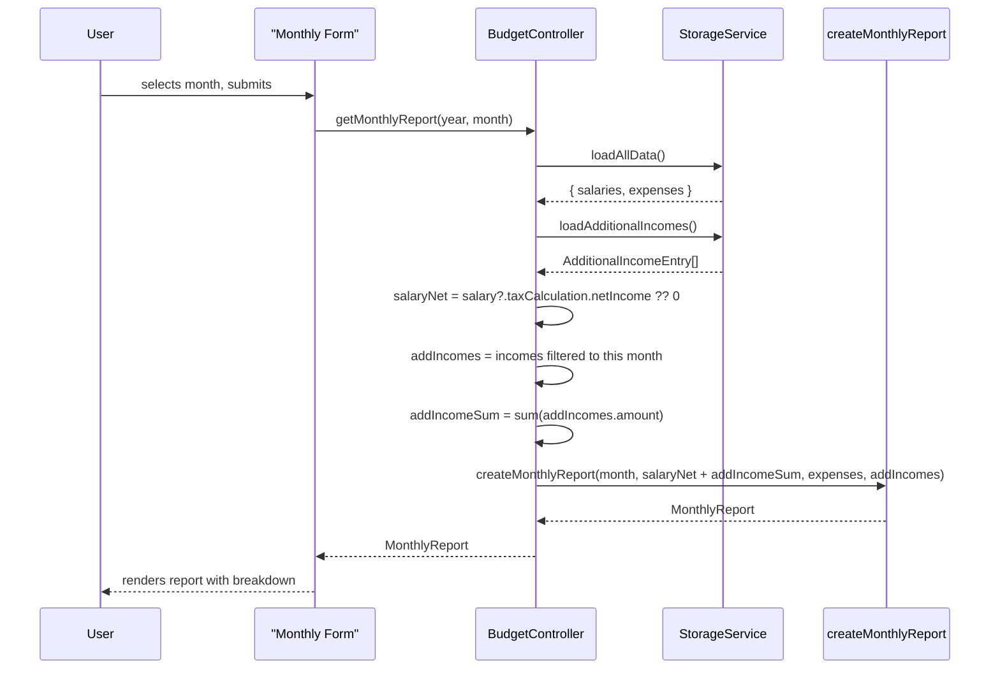

# Design Document

## Overview

This feature extends the Israeli Budget Tracker with two capabilities:

1. **Multiple incomes per month**: A new `AdditionalIncomeEntry` domain model lets users record supplementary income sources (freelance work, rental income, gifts, side jobs) alongside the primary payslip-based `SalaryRecord`. Each entry is tagged with an `incomeType` of either "משכורת" (Salary) or "אחר" (Other), has a month, a description, and an amount. Entries are persisted to `localStorage`, listed in the salary tab, and included in monthly/annual report total-income calculations.

2. **New expense category**: A static addition of "חתונות" (Weddings) to the predefined options in the expense category dropdown in `docs/index.html`.

The design reuses the existing `SavingsEntry` architectural pattern, which already solves the same shape of problem (CRUD on a monthly ledger of typed entries). The implementation follows the project's vanilla TypeScript → compiled bundle (`docs/app.js`) model and its Hebrew RTL UI conventions.

### Design Decisions and Rationale

| Decision | Rationale |
|---|---|
| Model `AdditionalIncomeEntry` after `SavingsEntry`, not extend `SalaryRecord` | Salary has tax-calculation semantics that don't apply. Additional incomes are raw amounts and should not run through `TaxCalculator`. |
| Add CRUD methods to `StorageService` with a new storage key | Matches the existing pattern (`SALARIES`, `EXPENSES`, `SAVINGS`). Keeps persistence concerns isolated. |
| Sum additional incomes into `MonthlyReport.netIncome` (rather than adding a new field) | Report consumers (chart UI, UI templates in `main.js`) already read `netIncome` and `totalIncome`. Summing at the controller level avoids cascading changes through `ChartDataPrepService`, templates, and tests. A new breakdown field is added for display but the aggregate stays in the existing field. |
| Create a new `AdditionalIncomeManager` UI class mirroring `SavingsTabManager` | `EntryManager` is already large (860+ lines) and specialized for salaries/expenses with tax calculation coupling. A dedicated manager is simpler and matches the `SavingsTabManager` precedent. |
| Add "חתונות" as a static `<option>` in `index.html` | The category dropdown is hardcoded HTML. No code change is needed; this is a one-line HTML edit. |

## Architecture

The feature slots into the existing 4-layer architecture with no new layers:



### Data Flow: Add Additional Income



### Data Flow: Monthly Report With Additional Incomes



## Components and Interfaces

### Domain Layer

#### `src/domain/types.ts` (additions)

```typescript
/**
 * Income type label for an additional income entry.
 * "משכורת" = Salary (a second/supplementary salary, e.g., side job)
 * "אחר"    = Other (freelance, rental, gifts, etc.)
 */
export type IncomeType = 'משכורת' | 'אחר';

/**
 * Input for creating an additional income entry.
 */
export interface AdditionalIncomeInput {
  incomeType: IncomeType;
  description: string;
  amount: number;
  month: Date;
}

/**
 * Stored additional income entry.
 */
export interface AdditionalIncomeEntry {
  id: string;
  incomeType: IncomeType;
  description: string;
  amount: number;
  month: Date;
  createdAt: Date;
}
```

Additions to the `MonthlyReport` and `AnnualReport` interfaces:

```typescript
export interface MonthlyReport {
  // ... existing fields ...
  additionalIncomes: AdditionalIncomeEntry[]; // NEW — entries for this month
  salaryNetIncome: number;                    // NEW — just the salary portion
  additionalIncomeTotal: number;              // NEW — sum of additional incomes
  // `netIncome` now represents total income (salary net + additional)
  // `netSavings` = netIncome - totalExpenses (unchanged formula)
}

export interface AnnualReport {
  // ... existing fields ...
  totalAdditionalIncome: number; // NEW — sum of additional incomes across all months
  // `totalIncome` now includes additional incomes
}
```

Notes:
- `netIncome` retains the same name for backward compatibility with chart/report templates but its semantics widen to "total income to the user for the month". A comment will be added to the type.
- `expensesByCategory` remains unchanged; "חתונות" flows through naturally because the map is keyed by the raw category string.

#### `src/domain/models.ts` (additions)

```typescript
/**
 * Create a new AdditionalIncomeEntry with generated ID, rounded amount, and current timestamp.
 */
export function createAdditionalIncomeEntry(
  input: AdditionalIncomeInput
): AdditionalIncomeEntry {
  return {
    id: generateId(),
    incomeType: input.incomeType,
    description: input.description,
    amount: roundToTwoDecimals(input.amount),
    month: input.month,
    createdAt: new Date()
  };
}
```

Modifications to `createMonthlyReport` and `createAnnualReport` to accept and sum additional incomes:

```typescript
export function createMonthlyReport(
  month: Date,
  salaryNetIncome: number,
  expenses: Expense[],
  additionalIncomes: AdditionalIncomeEntry[] = []
): MonthlyReport {
  const additionalIncomeTotal = roundToTwoDecimals(
    additionalIncomes.reduce((sum, e) => sum + e.amount, 0)
  );
  const netIncome = roundToTwoDecimals(salaryNetIncome + additionalIncomeTotal);
  // ... existing total expenses, category map, netSavings using netIncome ...
  return {
    month,
    netIncome,
    salaryNetIncome: roundToTwoDecimals(salaryNetIncome),
    additionalIncomes,
    additionalIncomeTotal,
    expenses,
    totalExpenses,
    expensesByCategory,
    netSavings: roundToTwoDecimals(netIncome - totalExpenses)
  };
}
```

`createAnnualReport` aggregates `additionalIncomeTotal` across monthly reports into `totalAdditionalIncome`, and `totalIncome` naturally aggregates the new (wider) `netIncome`.

### Data Access Layer

#### `src/data-access/StorageService.ts` (additions)

New storage key:

```typescript
const STORAGE_KEYS = {
  // ... existing ...
  ADDITIONAL_INCOMES: 'israeli-budget-tracker:additional-incomes'
} as const;
```

New interface methods:

```typescript
export interface StorageService {
  // ... existing ...
  saveAdditionalIncome(entry: AdditionalIncomeEntry): Promise<void>;
  loadAdditionalIncomes(): Promise<AdditionalIncomeEntry[]>;
  updateAdditionalIncome(id: string, entry: AdditionalIncomeEntry): Promise<void>;
  deleteAdditionalIncome(id: string): Promise<void>;
}
```

Implementation mirrors the savings methods exactly:

```typescript
async saveAdditionalIncome(entry: AdditionalIncomeEntry): Promise<void> {
  try {
    const entries = await this.loadAdditionalIncomes();
    entries.push(entry);
    this.saveToStorage(STORAGE_KEYS.ADDITIONAL_INCOMES, entries);
  } catch (error) {
    throw new Error(ERROR_MESSAGES.SAVE_FAILED); // "שמירת הנתונים נכשלה. אנא נסה שוב."
  }
}

async loadAdditionalIncomes(): Promise<AdditionalIncomeEntry[]> {
  try {
    const entries = this.loadFromStorage<AdditionalIncomeEntry[]>(
      STORAGE_KEYS.ADDITIONAL_INCOMES
    ) || [];
    return entries.map(e => ({
      ...e,
      month: new Date(e.month),
      createdAt: new Date(e.createdAt)
    }));
  } catch (error) {
    console.error(ERROR_MESSAGES.CORRUPTED_DATA, error);
    return [];
  }
}

async updateAdditionalIncome(id: string, entry: AdditionalIncomeEntry): Promise<void> {
  const entries = await this.loadAdditionalIncomes();
  const index = entries.findIndex(e => e.id === id);
  if (index === -1) throw new Error(ERROR_MESSAGES.RECORD_NOT_FOUND); // "הרשומה לא נמצאה"
  entries[index] = {
    ...entry,
    id: entries[index].id,
    createdAt: entries[index].createdAt
  };
  this.saveToStorage(STORAGE_KEYS.ADDITIONAL_INCOMES, entries);
}

async deleteAdditionalIncome(id: string): Promise<void> {
  const entries = await this.loadAdditionalIncomes();
  const filtered = entries.filter(e => e.id !== id);
  if (filtered.length === entries.length) {
    throw new Error(ERROR_MESSAGES.RECORD_NOT_FOUND);
  }
  this.saveToStorage(STORAGE_KEYS.ADDITIONAL_INCOMES, filtered);
}
```

#### `src/data-access/ValidationService.ts` (addition)

```typescript
validateAdditionalIncomeInput(input: AdditionalIncomeInput): ValidationResult {
  const errors: string[] = [];

  // incomeType must be one of the allowed values
  if (input.incomeType !== 'משכורת' && input.incomeType !== 'אחר') {
    errors.push('סוג הכנסה לא חוקי');
  }

  // description required, trimmed, max 200 chars
  const desc = (input.description ?? '').trim();
  if (desc.length === 0) {
    errors.push('תיאור חובה');
  } else if (desc.length > 200) {
    errors.push('התיאור חייב להיות עד 200 תווים');
  }

  // amount must be positive finite
  if (!Number.isFinite(input.amount) || input.amount <= 0) {
    errors.push('הסכום חייב להיות מספר חיובי');
  }

  // month must be a valid Date
  if (!(input.month instanceof Date) || isNaN(input.month.getTime())) {
    errors.push('חודש לא חוקי');
  }

  return { isValid: errors.length === 0, errors };
}
```

### Application Layer

#### `src/application/BudgetController.ts` (additions)

```typescript
async addAdditionalIncome(
  input: AdditionalIncomeInput
): Promise<Result<AdditionalIncomeEntry, ValidationError>> {
  const validation = this.validationService.validateAdditionalIncomeInput(input);
  if (!validation.isValid) {
    return { success: false, error: { field: 'additionalIncome', message: validation.errors.join(', ') } };
  }
  const entry = createAdditionalIncomeEntry(input);
  await this.storageService.saveAdditionalIncome(entry);
  return { success: true, value: entry };
}

async getAdditionalIncomes(): Promise<AdditionalIncomeEntry[]> {
  return this.storageService.loadAdditionalIncomes();
}

async updateAdditionalIncome(id: string, entry: AdditionalIncomeEntry): Promise<void> {
  await this.storageService.updateAdditionalIncome(id, entry);
}

async deleteAdditionalIncome(id: string): Promise<void> {
  await this.storageService.deleteAdditionalIncome(id);
}

/**
 * Filter additional incomes for a given year/month.
 */
private filterIncomesByMonth(
  incomes: AdditionalIncomeEntry[],
  year: number,
  month: number
): AdditionalIncomeEntry[] {
  return incomes.filter(
    e => e.month.getFullYear() === year && e.month.getMonth() === month
  );
}
```

Modified `getMonthlyReport`:

```typescript
async getMonthlyReport(year: number, month: number): Promise<MonthlyReport | null> {
  const data = await this.storageService.loadAllData();
  const incomes = await this.storageService.loadAdditionalIncomes();

  const salary = data.salaries.find(s =>
    s.month.getFullYear() === year && s.month.getMonth() === month
  );
  const monthIncomes = this.filterIncomesByMonth(incomes, year, month);

  // Requirement 5.4: return a report even when there's no salary, if there are additional incomes
  if (!salary && monthIncomes.length === 0) {
    return null;
  }

  const salaryNet = salary ? salary.taxCalculation.netIncome : 0;
  const expenses = this.expenseManager.getExpensesByMonth(data.expenses, year, month);

  return createMonthlyReport(new Date(year, month, 1), salaryNet, expenses, monthIncomes);
}
```

Modified `getAnnualReport`: for each of the 12 months, fetch that month's additional incomes and pass them to `createMonthlyReport`. `totalAdditionalIncome` is computed by summing `report.additionalIncomeTotal` across the 12 reports.

### Presentation Layer

#### `docs/index.html` changes

**1. Expense category dropdown — add "חתונות"** (Requirement 7):

The existing `<select id="expenseCategory">` currently contains the options: אחר, ביגוד, בילויים, בריאות, דירה, חינוך, חשמל ומים, מזון, תחבורה (ordered by Hebrew alphabet). "חתונות" inserts between "חשמל ומים" and "מזון":

```html
<select id="expenseCategory">
    <option value="">ללא קטגוריה</option>
    <option value="אחר">אחר</option>
    <option value="ביגוד">ביגוד</option>
    <option value="בילויים">בילויים</option>
    <option value="בריאות">בריאות</option>
    <option value="דירה">דירה</option>
    <option value="חינוך">חינוך</option>
    <option value="חשמל ומים">חשמל ומים</option>
    <option value="חתונות">חתונות</option>   <!-- NEW -->
    <option value="מזון">מזון</option>
    <option value="תחבורה">תחבורה</option>
</select>
```

**2. Additional Income section in the salary tab** — inserted inside `<div class="tab-content active" id="salary-tab">`, after the existing `<div id="salary-entry-section">` so it lives below the salary form and its results:

```html
<!-- Additional Income Section -->
<div id="additional-income-section" class="entry-section">
    <h3>הכנסות נוספות</h3>

    <form id="additional-income-form" novalidate>
        <div class="form-group">
            <label for="additionalIncomeMonth">חודש:</label>
            <select id="additionalIncomeMonth" aria-label="חודש" required></select>
        </div>

        <div class="form-group">
            <label for="additionalIncomeType">סוג הכנסה:</label>
            <select id="additionalIncomeType" required>
                <option value="משכורת">משכורת</option>
                <option value="אחר" selected>אחר</option>
            </select>
        </div>

        <div class="form-group">
            <label for="additionalIncomeDescription">תיאור:</label>
            <input type="text" id="additionalIncomeDescription" maxlength="200" required>
        </div>

        <div class="form-group">
            <label for="additionalIncomeAmount">סכום (₪):</label>
            <input type="number" id="additionalIncomeAmount" step="0.01" min="0.01" required>
        </div>

        <button type="submit" class="btn-primary">הוסף הכנסה נוספת</button>
    </form>

    <div id="additional-income-result" class="result-box" style="display: none;"></div>

    <h4>רשומות הכנסות נוספות</h4>
    <div id="additional-income-list" class="entry-list">
        <!-- Entries rendered by AdditionalIncomeManager -->
    </div>
</div>
```

#### `src/presentation/AdditionalIncomeManager.ts` (new)

A new presentation class that mirrors `SavingsTabManager`. Key responsibilities:

- `init()`: populate month selector with 12 Hebrew month names (via `LocalizationService.getMonthName`), default to current month, attach form submit handler, initial render.
- `handleFormSubmit()`: read form values → build `AdditionalIncomeInput` → call `validationService.validateAdditionalIncomeInput` → on success call `budgetController.addAdditionalIncome` → show "✓ ההכנסה הנוספת נוספה בהצלחה!" → clear description/amount → `renderEntries()`.
- `renderEntries()`: load entries via `budgetController.getAdditionalIncomes()`, sort by `month` descending (ties broken by `createdAt` descending), render empty state "לא נמצאו הכנסות נוספות" if empty, otherwise produce one `.entry-item` per entry with month name, type, description, amount, and Edit/Delete buttons.
- `showEditForm(entry)`: modal overlay pre-populated with entry values. Submits through `budgetController.updateAdditionalIncome`, preserving `id` and `createdAt`.
- `showDeleteConfirmation(id)`: Hebrew confirmation modal "האם אתה בטוח שברצונך למחוק רשומה זו?". On confirm, calls `budgetController.deleteAdditionalIncome(id)` then `renderEntries()`.
- `formatCurrency(amount)`: reuses the `Intl.NumberFormat('he-IL', { style: 'currency', currency: 'ILS' })` pattern from `SavingsTabManager`.

Constructor signature:

```typescript
constructor(
  private budgetController: BudgetController,
  private validationService: ValidationService,
  private localizationService: LocalizationService
) {}
```

#### `docs/main.js` changes

Wire the new manager in the `DOMContentLoaded` handler, near where `SavingsTabManager` is instantiated:

```javascript
// Initialize AdditionalIncomeManager
const additionalIncomeManager = new window.AdditionalIncomeManager(
    budgetController,
    validationService,
    localizationService
);
additionalIncomeManager.init();
```

In the existing tab-click handler, ensure that when the `salary` tab is activated, additional income entries are re-rendered (so the list stays fresh after edits in other tabs):

```javascript
if (btn.dataset.tab === 'salary' && salaryEntryListContainer) {
    await entryManager.renderSalaryList(salaryEntryListContainer);
    await additionalIncomeManager.renderEntries();  // NEW
}
```

The monthly and annual report rendering code in `main.js` that produces HTML tables already reads `report.netIncome` and `report.totalIncome`. Those values will automatically include additional incomes once `BudgetController` starts summing them. A small enhancement (Requirement 5.2) adds a dedicated breakdown block listing `salaryNetIncome` and each entry in `additionalIncomes[]`.

#### `src/presentation/EntryManager.ts`

No changes. The existing class is specialized for salary and expense entries with tax-calculation coupling; reusing it for additional incomes would require invasive generalization. A sibling `AdditionalIncomeManager` (mirroring `SavingsTabManager`) is cleaner.

### Build Bundle

`build.js` concatenates `src/**` into `docs/app.js`. The new files (`AdditionalIncomeManager.ts`, plus the additions to `types.ts`, `models.ts`, `StorageService.ts`, `ValidationService.ts`, `BudgetController.ts`) will be picked up automatically. The new class must be exposed on `window` (e.g. `window.AdditionalIncomeManager = AdditionalIncomeManager`) consistent with the existing pattern used by `SavingsTabManager`.

## Data Models

### AdditionalIncomeEntry (stored)

| Field | Type | Required | Notes |
|---|---|---|---|
| id | `string` | yes | UUID generated by `generateId()` |
| incomeType | `IncomeType` | yes | `'משכורת'` or `'אחר'` |
| description | `string` | yes | 1–200 chars, trimmed |
| amount | `number` | yes | > 0, rounded to 2 decimals |
| month | `Date` | yes | Set to first day of the month |
| createdAt | `Date` | yes | Populated by the factory |

### AdditionalIncomeInput

Same fields as `AdditionalIncomeEntry` minus `id` and `createdAt`.

### localStorage layout

New key: `israeli-budget-tracker:additional-incomes` → JSON array of serialized `AdditionalIncomeEntry`. `month` and `createdAt` are serialized as ISO strings by `JSON.stringify` and re-hydrated to `Date` by `loadAdditionalIncomes`.

### Report model extensions

- `MonthlyReport.netIncome` now = `salaryNetIncome + additionalIncomeTotal`.
- `MonthlyReport.additionalIncomes`, `salaryNetIncome`, `additionalIncomeTotal` are new fields.
- `AnnualReport.totalIncome` now aggregates the wider `netIncome`. `totalAdditionalIncome` is new.

## Correctness Properties

*A property is a characteristic or behavior that should hold true across all valid executions of a system — essentially, a formal statement about what the system should do. Properties serve as the bridge between human-readable specifications and machine-verifiable correctness guarantees.*

The properties below cover the additional-income part of the feature. The "חתונות" category addition is a static HTML change; it is verified with example-based DOM/integration tests (see Testing Strategy) and does not yield meaningful universal properties.

### Property 1: Factory correctness

*For any* valid `AdditionalIncomeInput`, `createAdditionalIncomeEntry(input)` produces an `AdditionalIncomeEntry` such that: `id` is a non-empty string and is unique across invocations; `createdAt` is a `Date` within a small window of the call time; `amount` has at most 2 decimal places and `|amount − input.amount| ≤ 0.005`; and `incomeType`, `description`, `month` are preserved from the input.

**Validates: Requirements 1.3, 1.4**

### Property 2: Persistence round-trip

*For any* list of valid `AdditionalIncomeEntry` values, saving each entry via `saveAdditionalIncome` and then calling `loadAdditionalIncomes` returns a list equivalent to the original (same entries by id), with `month` and `createdAt` as `Date` instances (not strings).

**Validates: Requirements 2.1, 2.2**

### Property 3: Update preserves identity

*For any* non-empty stored state of additional-income entries, any id present in that state, and any replacement `AdditionalIncomeEntry`, calling `updateAdditionalIncome(id, replacement)` and then `loadAdditionalIncomes` returns a list where the entry with that id has the replacement's `incomeType`, `description`, `amount`, and `month`, while its `id` and `createdAt` match the original. All other entries are unchanged.

**Validates: Requirement 2.3**

### Property 4: Delete removes only the target

*For any* non-empty stored state of additional-income entries and any id present in that state, calling `deleteAdditionalIncome(id)` and then `loadAdditionalIncomes` returns a list that is the original state minus the entry with that id. All other entries are present and unchanged.

**Validates: Requirement 2.4**

### Property 5: CRUD on unknown id rejects with Hebrew error

*For any* stored state of additional-income entries and any id not present in that state, both `updateAdditionalIncome(id, anyEntry)` and `deleteAdditionalIncome(id)` throw an `Error` whose `message` equals `"הרשומה לא נמצאה"`.

**Validates: Requirement 2.5**

### Property 6: Validator correctness

*For any* `AdditionalIncomeInput`, `validateAdditionalIncomeInput(input)` returns `{ isValid: true, errors: [] }` if and only if all of the following hold: `input.amount` is a finite number strictly greater than 0; the trimmed `input.description` has length in the range `[1, 200]`; `input.incomeType ∈ {"משכורת", "אחר"}`; and `input.month` is a valid `Date`. When any of these fail, `isValid` is `false` and `errors` contains the corresponding Hebrew message(s) from `ERROR_MESSAGES`.

**Validates: Requirements 3.5, 3.6, and the `incomeType` constraint from 1.1**

### Property 7: Form submission persists a matching entry

*For any* valid form input (month from 1–12, incomeType ∈ {"משכורת","אחר"}, description with 1–200 trimmed chars, amount > 0 finite), submitting the additional-income form through `AdditionalIncomeManager` results in exactly one new entry in `loadAdditionalIncomes()` whose `incomeType`, `description`, `month` (year/month) match the form, whose `amount` equals the input rounded to 2 decimals, and in the `#additional-income-result` element containing the exact string `"✓ ההכנסה הנוספת נוספה בהצלחה!"`.

**Validates: Requirement 3.4**

### Property 8: Rendered list is sorted by month descending

*For any* set of `AdditionalIncomeEntry` values stored, after `renderEntries()`, the children of `#additional-income-list` appear in order of decreasing `month`. Ties on `month` are broken by `createdAt` descending. The `data-id` sequence read from the DOM equals the input list sorted by `(month desc, createdAt desc)`.

**Validates: Requirement 4.1**

### Property 9: Edit form pre-population

*For any* entry in the rendered additional-income list, clicking its edit button reveals a form whose `#edit-additional-income-type` select value equals the entry's `incomeType`, whose `#edit-additional-income-description` value equals the entry's `description`, whose `#edit-additional-income-amount` value equals the entry's `amount`, and whose `#edit-additional-income-month` value equals `String(entry.month.getMonth() + 1)`.

**Validates: Requirement 4.3**

### Property 10: Delete removes entry from DOM and storage

*For any* non-empty rendered state of additional-income entries and any rendered entry, after clicking that entry's delete button and confirming in the modal, the entry's `data-id` is absent from `#additional-income-list`, it is absent from `loadAdditionalIncomes()`, and every other entry remains present in both the DOM and storage.

**Validates: Requirement 4.5**

### Property 11: Monthly report total income invariant

*For any* salary net income (possibly 0) and any list of additional incomes associated with a given month, the `MonthlyReport` produced by `createMonthlyReport` satisfies: `report.netIncome` equals the sum `salaryNetIncome + Σ incomes[i].amount`, rounded to 2 decimals; `report.salaryNetIncome` equals the input salary net income, rounded to 2 decimals; and `report.additionalIncomeTotal` equals `Σ incomes[i].amount`, rounded to 2 decimals. Generators include the case where salary is absent (`salaryNetIncome = 0`) to cover Requirement 5.4.

**Validates: Requirements 5.1, 5.4**

### Property 12: Monthly report savings invariant

*For any* `MonthlyReport` produced by `createMonthlyReport`, `report.netSavings` equals `report.netIncome − report.totalExpenses` (within rounding tolerance of ±0.01).

**Validates: Requirement 5.3**

### Property 13: Annual report aggregation invariant

*For any* collection of salary records and additional income entries spread across the 12 months covered by the annual report, the `AnnualReport` produced by `createAnnualReport` satisfies all of: `totalIncome` equals `Σ monthlyReports[i].netIncome`; `totalAdditionalIncome` equals `Σ monthlyReports[i].additionalIncomeTotal` (equivalently, the sum of all `additionalIncomes[i].amount` across all 12 months); `totalExpenses` equals `Σ monthlyReports[i].totalExpenses`; and `totalSavings` equals `totalIncome − totalExpenses` (within rounding tolerance of ±0.01).

**Validates: Requirements 6.1, 6.2**

## Error Handling

| Scenario | Behavior |
|---|---|
| Empty/whitespace description | `ValidationService` returns "תיאור חובה"; form shows inline error; submission blocked. |
| Description > 200 chars | Validation returns "התיאור חייב להיות עד 200 תווים"; form shows inline error; submission blocked. |
| Amount ≤ 0 or not finite | Validation returns "הסכום חייב להיות מספר חיובי"; form shows inline error; submission blocked. |
| Invalid income type | Validation returns "סוג הכנסה לא חוקי"; form shows inline error. (The UI dropdown constrains this, but the validator defends against direct model use.) |
| `localStorage` quota exceeded / write throws | `StorageService.saveAdditionalIncome` catches and rethrows with "שמירת הנתונים נכשלה. אנא נסה שוב." (`ERROR_MESSAGES.SAVE_FAILED`). Manager displays in the result box. |
| `update` / `delete` for unknown id | `StorageService` throws "הרשומה לא נמצאה" (`ERROR_MESSAGES.RECORD_NOT_FOUND`). Manager surfaces the message in the edit form's error area or logs and closes the confirm dialog. |
| Corrupted JSON in localStorage | `loadAdditionalIncomes` catches `SyntaxError`, logs via `console.error` with `ERROR_MESSAGES.CORRUPTED_DATA`, returns `[]` — matches `loadSavingsEntries` behavior. |
| Monthly report for a month with additional incomes but no salary | `getMonthlyReport` returns a report with `salaryNetIncome = 0` and `netIncome = additionalIncomeTotal` (Requirement 5.4). |

## Testing Strategy

### Assessment: Is PBT appropriate?

This feature has two parts with different testing needs.

**Part 1 — Additional Income (PBT IS appropriate)**

- The data model has clear input/output behavior (`createAdditionalIncomeEntry` is a pure function over its input).
- Persistence has round-trip semantics (save → load should return the same data).
- Report aggregation is an invariant: for any set of salary and additional income entries, `MonthlyReport.netIncome == salaryNetIncome + additionalIncomeTotal`.
- Validation has universal properties (e.g. for any whitespace-only description, validation fails).

**Part 2 — "חתונות" category addition (PBT does NOT apply)**

- This is a one-line static HTML edit (adding an `<option>` to a `<select>`).
- No code logic varies with input. The `ExpenseCategory` string flows through existing category-agnostic code (`expensesByCategory: Map<string, number>`), which is already covered by `models.test.ts`.
- Testing: a simple DOM assertion (in an integration-style test) that the expense category `<select>` contains an `<option value="חתונות">`. No property test needed.

### Test Layers

**Unit tests (`*.test.ts`)**:
- `models.test.ts`: factory correctness, rounding, default `createdAt`.
- `StorageService.test.ts`: CRUD for additional incomes, date deserialization, error cases (not found, corrupted JSON).
- `ValidationService.test.ts`: each validation rule, boundary cases (199/200/201 char descriptions).
- `BudgetController.test.ts`: `getMonthlyReport` with salary-only, incomes-only, both, neither; `getAnnualReport` aggregation.

**Integration / DOM tests**:
- `AdditionalIncomeManager.test.ts` (using jsdom, following the existing `EntryManager.test.ts` pattern): form submit flow, edit form flow, delete confirmation flow, empty state rendering.
- HTML integration check: `#expenseCategory` contains `<option value="חתונות">`.

**Property-based tests** (see Correctness Properties below): implemented with `fast-check` (the project's existing PBT library choice; available via `npm`). Each property test configured with minimum 100 iterations and tagged `// Feature: multiple-incomes-and-categories, Property N: <text>`.

Dual testing approach:
- Unit tests cover specific examples and edge cases.
- Property tests cover universal invariants (round-trip, aggregation, validation).

