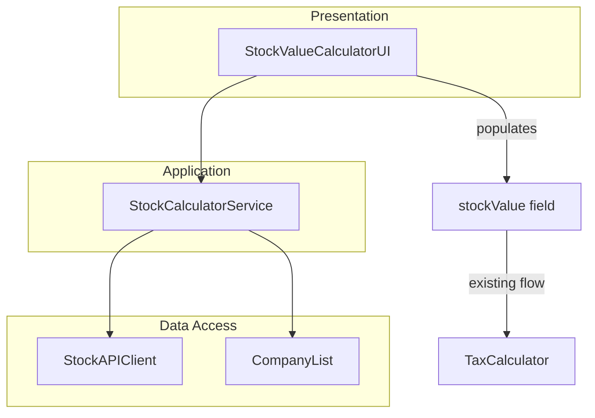

# Design Document: Stock Value Calculator

## Overview

This feature enhances the existing `stockValue` field in the salary form by adding automatic stock price lookup and calculation. Users can select their employer company from a predefined list of Israeli tech employers (traded on TASE, NASDAQ, NYSE), fetch the current stock price via a free client-side API, enter their share count, and have the system compute the total stock value in ILS. The calculated value feeds directly into the existing `SalaryComponents.stockValue` field and the tax calculation pipeline.

The feature provides a toggle between automatic calculation mode and manual entry mode (current behavior), defaulting to manual mode for backward compatibility. Company selection is persisted to localStorage so users don't need to re-search each time.

### Key Design Goals

- Fetch real-time stock prices from a free, browser-compatible API (no backend required)
- Convert USD-denominated stock prices to ILS using a fetched exchange rate
- Seamlessly integrate with the existing `stockValue` field and `TaxCalculator`
- Persist company selection across sessions via localStorage
- Provide Hebrew RTL UI consistent with the rest of the application
- Graceful fallback to manual entry when API is unavailable

## Architecture

The stock value calculator integrates into the existing layered architecture as a new vertical slice:



### Layer Placement

- **Data Access Layer**: `StockAPIClient` (fetches stock prices and exchange rates via browser `fetch`), `STOCK_COMPANY_LIST` (static company data)
- **Application Layer**: `StockCalculatorService` (orchestrates price fetching, exchange rate conversion, and value computation)
- **Presentation Layer**: `StockValueCalculatorUI` (manages the company selector, share input, mode toggle, and populates the `stockValue` field)

### Build Integration

New files are added to the `build.js` file list and their classes exposed on `window`, following the existing pattern. All module-level constants use unique prefixed names to avoid collisions in the concatenated bundle (e.g., `STOCK_COMPANY_LIST`, `STOCK_CALC_MESSAGES`, `STOCK_STORAGE_KEYS`).

## Components and Interfaces

### CompanyList (Static Data)

A predefined array of publicly traded companies commonly associated with Israeli tech employers. Stored as a constant in the data-access layer.

```typescript
interface CompanyInfo {
  ticker: string;       // e.g., "CHKP", "NICE", "TEVA"
  name: string;         // Hebrew-friendly display name
  exchange: string;     // "NASDAQ" | "NYSE" | "TASE"
  currency: string;     // "USD" | "ILS"
}

// Unique name to avoid bundle collision
const STOCK_COMPANY_LIST: CompanyInfo[] = [
  { ticker: "CHKP", name: "Check Point Software", exchange: "NASDAQ", currency: "USD" },
  { ticker: "NICE", name: "NICE Systems", exchange: "NASDAQ", currency: "USD" },
  { ticker: "MNDY", name: "monday.com", exchange: "NASDAQ", currency: "USD" },
  { ticker: "TEVA", name: "Teva Pharmaceutical", exchange: "NYSE", currency: "USD" },
  { ticker: "WIX", name: "Wix.com", exchange: "NASDAQ", currency: "USD" },
  { ticker: "GLBE", name: "Global-e Online", exchange: "NASDAQ", currency: "USD" },
  { ticker: "CYBR", name: "CyberArk Software", exchange: "NASDAQ", currency: "USD" },
  { ticker: "INMD", name: "InMode", exchange: "NASDAQ", currency: "USD" },
  { ticker: "FVRR", name: "Fiverr International", exchange: "NYSE", currency: "USD" },
  { ticker: "RSKD", name: "Riskified", exchange: "NYSE", currency: "USD" },
  { ticker: "PAYC", name: "Paycom Software", exchange: "NYSE", currency: "USD" },
  { ticker: "CRNT", name: "Ceragon Networks", exchange: "NASDAQ", currency: "USD" },
  { ticker: "SEDG", name: "SolarEdge Technologies", exchange: "NASDAQ", currency: "USD" },
  { ticker: "NVDA", name: "NVIDIA", exchange: "NASDAQ", currency: "USD" },
  { ticker: "GOOG", name: "Alphabet (Google)", exchange: "NASDAQ", currency: "USD" },
  { ticker: "AAPL", name: "Apple", exchange: "NASDAQ", currency: "USD" },
  { ticker: "MSFT", name: "Microsoft", exchange: "NASDAQ", currency: "USD" },
  { ticker: "META", name: "Meta Platforms", exchange: "NASDAQ", currency: "USD" },
  { ticker: "AMZN", name: "Amazon", exchange: "NASDAQ", currency: "USD" },
  { ticker: "INTC", name: "Intel", exchange: "NASDAQ", currency: "USD" },
  // Additional companies can be added
];
```

### StockAPIClient

Fetches stock prices and exchange rates using free public APIs from the browser. Uses the Yahoo Finance v8 unofficial API endpoint which supports CORS and requires no API key.

```typescript
interface StockPriceResult {
  ticker: string;
  price: number;
  currency: string;
  marketTime: Date;
}

interface ExchangeRateResult {
  from: string;
  to: string;
  rate: number;
  timestamp: Date;
}

class StockAPIClient {
  /** Fetch current stock price for a ticker */
  async fetchStockPrice(ticker: string): Promise<StockPriceResult>;

  /** Fetch USD/ILS exchange rate */
  async fetchExchangeRate(from: string, to: string): Promise<ExchangeRateResult>;
}
```

**API Choice Rationale**: The Yahoo Finance v8 API (`query1.finance.yahoo.com/v8/finance/chart/{TICKER}`) is free, requires no API key, and can be called from the browser. It returns current price, currency, and market timestamp. For the exchange rate, the same API is used with the `USDILS=X` ticker symbol.

**Fallback**: If the API is unreachable or returns an error, the user is prompted to enter a manual price. The exchange rate can also be manually entered.

### StockCalculatorService

Application-layer service that orchestrates the stock value calculation.

```typescript
interface StockCalculation {
  ticker: string;
  companyName: string;
  stockPrice: number;
  currency: string;
  shares: number;
  exchangeRate: number | null;  // null if already in ILS
  totalValueILS: number;
  priceDate: Date;
}

class StockCalculatorService {
  constructor(private apiClient: StockAPIClient);

  /** Calculate total stock value in ILS */
  async calculateStockValue(
    ticker: string,
    companyName: string,
    shares: number,
    currency: string
  ): Promise<StockCalculation>;

  /** Compute value from known inputs (no API call) */
  computeStockValue(
    price: number,
    shares: number,
    exchangeRate: number | null,
    currency: string
  ): number;
}
```

**Calculation Logic**:
- If currency is ILS: `totalValueILS = price × shares`
- If currency is USD: `totalValueILS = price × shares × exchangeRate`
- Result is rounded to 2 decimal places

### StockValueCalculatorUI

Presentation-layer class that manages the stock calculator UI within the salary form.

```typescript
class StockValueCalculatorUI {
  constructor(
    private calculatorService: StockCalculatorService,
    private localizationService: LocalizationService
  );

  /** Initialize the UI, attach event listeners, restore persisted state */
  init(): void;

  /** Filter company list based on search query */
  filterCompanies(query: string): CompanyInfo[];

  /** Handle company selection */
  selectCompany(company: CompanyInfo): void;

  /** Toggle between auto and manual mode */
  setMode(mode: 'auto' | 'manual'): void;

  /** Recalculate and update the stockValue field */
  updateStockValue(): void;
}
```

## Data Models

### CompanyInfo

```typescript
interface CompanyInfo {
  ticker: string;
  name: string;
  exchange: string;
  currency: string;
}
```

### StockPriceResult

```typescript
interface StockPriceResult {
  ticker: string;
  price: number;
  currency: string;
  marketTime: Date;
}
```

### ExchangeRateResult

```typescript
interface ExchangeRateResult {
  from: string;
  to: string;
  rate: number;
  timestamp: Date;
}
```

### StockCalculation

```typescript
interface StockCalculation {
  ticker: string;
  companyName: string;
  stockPrice: number;
  currency: string;
  shares: number;
  exchangeRate: number | null;
  totalValueILS: number;
  priceDate: Date;
}
```

### Persisted Stock Selection (localStorage)

```typescript
interface PersistedStockSelection {
  ticker: string;
  companyName: string;
}
```

Storage key: `israeli-budget-tracker:stock-selection`

### Integration with Existing Types

The calculated `totalValueILS` is written directly to the existing `SalaryComponents.stockValue` field (type `number | undefined`). No changes to existing domain types are required.


## Correctness Properties

*A property is a characteristic or behavior that should hold true across all valid executions of a system—essentially, a formal statement about what the system should do. Properties serve as the bridge between human-readable specifications and machine-verifiable correctness guarantees.*

### Property 1: Company Filter Returns Only Matching Results

*For any* search query of 2 or more characters and any company list, every company returned by the filter function should have either its name or its ticker symbol matching the query (case-insensitive substring match). Additionally, no company that matches should be excluded from the results.

**Validates: Requirements 1.2**

### Property 2: Stock Value Calculation Correctness

*For any* positive stock price, positive share count, and positive exchange rate, the computed stock value in ILS should equal:
- `price × shares` when the currency is ILS
- `price × shares × exchangeRate` when the currency is USD

rounded to two decimal places.

**Validates: Requirements 3.2, 3.3, 4.4**

### Property 3: Share Input Validation

*For any* numeric input, the share count should be accepted if and only if it is a positive number (greater than zero). Non-positive values (zero, negative) should be rejected.

**Validates: Requirements 3.1**

### Property 4: Company Selection Persistence Round-Trip

*For any* company selected from the list, persisting the selection to localStorage and then loading it back should produce the same ticker and company name.

**Validates: Requirements 6.1, 6.2**

### Property 5: Computed Value is a Valid stockValue

*For any* set of valid calculation inputs (positive price, positive shares, positive exchange rate if USD), the output should be a finite non-negative number with at most two decimal places, compatible with the existing `SalaryComponents.stockValue` field type.

**Validates: Requirements 7.2, 4.4**

### Property 6: Stored stockValue is Mode-Independent

*For any* final numeric value in the stockValue field at form submission time, the stored `SalaryComponents.stockValue` should equal that value regardless of whether it was computed automatically or entered manually.

**Validates: Requirements 7.3**

### Property 7: Price Display Contains Required Information

*For any* successfully fetched stock price result, the formatted display string should contain the price value, the currency identifier, and the price date.

**Validates: Requirements 2.2**

### Property 8: Conversion Display Shows Both Currencies

*For any* stock price in a foreign currency (USD) with a valid exchange rate, the display should contain both the original USD price and the converted ILS price.

**Validates: Requirements 4.3**

### Property 9: Autocomplete Dropdown Format

*For any* company in the filtered results, the display string should contain both the company name and the ticker symbol.

**Validates: Requirements 8.3**

## Error Handling

### API Errors

- **Stock Price Fetch Failure**: Display "שגיאה בטעינת מחיר המניה. נסה שוב או הזן מחיר ידנית" (Error loading stock price. Try again or enter price manually). Enable manual price input field as fallback.
- **Exchange Rate Fetch Failure**: Display "שגיאה בטעינת שער החליפין. הזן שער ידנית" (Error loading exchange rate. Enter rate manually). Enable manual exchange rate input field.
- **Network Timeout**: After 10 seconds, treat as fetch failure and show the same error messages above.
- **Invalid API Response**: If the API returns unexpected data structure, treat as fetch failure.

### Input Validation Errors

- **Invalid Share Count**: Display "מספר המניות חייב להיות מספר חיובי" (Number of shares must be a positive number).
- **Invalid Manual Price**: Display "מחיר המניה חייב להיות מספר חיובי" (Stock price must be a positive number).
- **Invalid Manual Exchange Rate**: Display "שער החליפין חייב להיות מספר חיובי" (Exchange rate must be a positive number).

### State Errors

- **No Company Selected**: The calculate button is disabled until a company is selected. Share input is also disabled.
- **Corrupted localStorage Data**: If persisted stock selection is corrupted, silently clear it and start fresh (manual mode).

### Error Recovery

- All API errors allow retry via a retry button
- All API errors allow fallback to manual entry
- Validation errors preserve current form state and highlight the invalid field

## Testing Strategy

### Property-Based Testing

Property-based testing uses **fast-check** (already in devDependencies) to verify universal properties across randomized inputs. Each property test runs a minimum of 100 iterations.

**Property Tests to Implement:**

1. **Property 1: Company Filter** - Generate random query strings (2+ chars) and company lists, verify all results match and no matches are missed.
   - Tag: *Feature: stock-value-calculator, Property 1: Company filter returns only matching results*

2. **Property 2: Stock Value Calculation** - Generate random prices, share counts, and exchange rates, verify the formula `price × shares × exchangeRate` (or `price × shares` for ILS) holds with 2 decimal rounding.
   - Tag: *Feature: stock-value-calculator, Property 2: Stock value calculation correctness*

3. **Property 3: Share Input Validation** - Generate random numbers (positive, zero, negative), verify acceptance/rejection.
   - Tag: *Feature: stock-value-calculator, Property 3: Share input validation accepts only positive numbers*

4. **Property 4: Company Selection Persistence** - Generate random company info objects, persist and load, verify round-trip equality.
   - Tag: *Feature: stock-value-calculator, Property 4: Company selection persistence round-trip*

5. **Property 5: Computed Value Validity** - Generate random valid inputs, verify output is finite, non-negative, and has ≤2 decimal places.
   - Tag: *Feature: stock-value-calculator, Property 5: Computed value is a valid stockValue*

6. **Property 6: Mode-Independent Storage** - Generate random numeric values, simulate both auto and manual modes, verify stored value matches.
   - Tag: *Feature: stock-value-calculator, Property 6: Stored stockValue is mode-independent*

7. **Property 7: Price Display Completeness** - Generate random StockPriceResult objects, verify formatted display contains price, currency, and date.
   - Tag: *Feature: stock-value-calculator, Property 7: Price display contains required information*

8. **Property 8: Conversion Display** - Generate random USD prices and exchange rates, verify display contains both USD and ILS values.
   - Tag: *Feature: stock-value-calculator, Property 8: Conversion display shows both currencies*

9. **Property 9: Autocomplete Format** - Generate random CompanyInfo objects, verify display string contains name and ticker.
   - Tag: *Feature: stock-value-calculator, Property 9: Autocomplete dropdown format includes name and ticker*

### Unit Testing

Unit tests cover specific examples, edge cases, and integration points:

1. **Company Search**:
   - Search "check" returns Check Point
   - Search "CHKP" returns Check Point (ticker match)
   - Search with 1 character returns empty (minimum 2 chars)
   - Search "xyz" returns empty with "no results" message (edge case from 1.5)

2. **API Integration**:
   - Successful price fetch returns expected structure
   - API timeout triggers error state
   - API error response triggers fallback to manual entry
   - Exchange rate fetch for USD stocks

3. **Mode Toggle**:
   - Default mode is manual (5.4)
   - Switching to auto disables manual input (5.3)
   - Switching to manual enables direct editing (5.2)
   - Auto mode recalculates on input change (3.5)

4. **Edge Cases**:
   - Very large share counts (e.g., 1,000,000)
   - Very small stock prices (e.g., $0.01)
   - Exchange rate of exactly 1.0
   - Company with ILS currency (no conversion needed)

5. **Persistence**:
   - Load with no persisted company (fresh state)
   - Load with persisted company triggers auto-fetch (6.3)
   - Corrupted localStorage handled gracefully

### Testing Tools

- **Property-Based Testing**: fast-check (already installed)
- **Unit Testing**: Vitest (already installed)
- **Mocking**: Vitest mocks for fetch API calls
- **DOM Testing**: jsdom (already installed) for UI component tests
